# HW01 – QA/QC Jobs · 20 Defects · Test a Physical Product

**Họ và tên:** Ngô Hồng Thanh
**MSSV:** 23127475  

---

## Requirement 1 – Thị trường việc làm QA/QC 2026+ (40 điểm)

**Mục tiêu:** Tìm 10 tin tuyển dụng QA/QC được đăng trong vòng 60 ngày tính đến ngày nộp bài, trong đó **ít nhất 3 vị trí yêu cầu kỹ năng AI/LLM/automation-AI**.

---

### Job 1 – Fresher Full-stack Test Engineer (QA/QC/Tester)

| Thuộc tính | Nội dung |
|---|---|
| **Công ty** | KMS Technology |
| **Link** | [LinkedIn Job #4417931013](https://www.linkedin.com/jobs/search-results/?currentJobId=4417931013&keywords=qa%2Fqc%20AI&origin=SEMANTIC_SEARCH_LANDING_PAGE) |
| **Mức lương** | Không công bố (Attractive Salary – thỏa thuận) |

**Screenshot:** 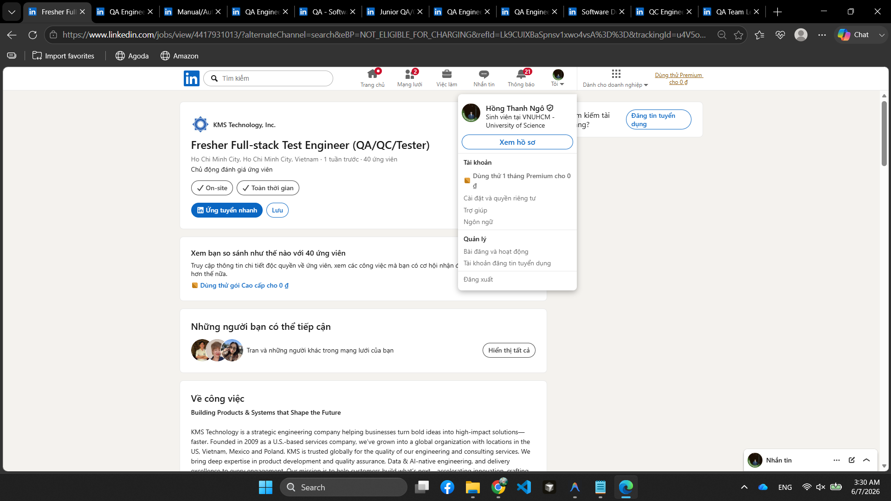

**Mô tả công việc tóm tắt:**  
Vị trí dành cho sinh viên năm 4 hoặc mới tốt nghiệp ngành CNTT. Công việc bao gồm phát triển và thực thi test case, theo dõi defect, chuẩn bị tài liệu kiểm thử, và giao tiếp tiến độ với khách hàng.

**Kỹ năng yêu cầu:**
- Nền tảng CNTT vững, GPA ≥ 7.5
- Tiếng Anh trung-cao cấp
- Hiểu biết về manual, automation, integration, unit và API testing
- Lập trình Python / Java / JavaScript
- *Nice to have:* Sử dụng AI chat tools (ChatGPT, Claude, Gemini…), GitHub Copilot, viết prompt hiệu quả, ý thức về giới hạn và bảo mật dữ liệu khi dùng AI

**AI Impact Analysis:**  
Vị trí fresher này đã liệt kê AI như một điểm cộng (nice to have), cho thấy KMS đang chuẩn bị nhân lực thích nghi với AI-assisted testing. Trong tương lai gần, các tác vụ viết test case lặp lại và debug cơ bản có thể được AI hỗ trợ, giảm tải cho engineer cấp junior.

---

### Job 2 – QA Engineer – Naver Clip

| Thuộc tính | Nội dung |
|---|---|
| **Công ty** | NAVER Vietnam |
| **Link** | [LinkedIn Job #4405746180](https://www.linkedin.com/jobs/search-results/?currentJobId=4405746180&keywords=qa%2Fqc%20AI&origin=SEMANTIC_SEARCH_LANDING_PAGE) |
| **Mức lương** | Không công bố (Competitive rewards) |

**Screenshot:** 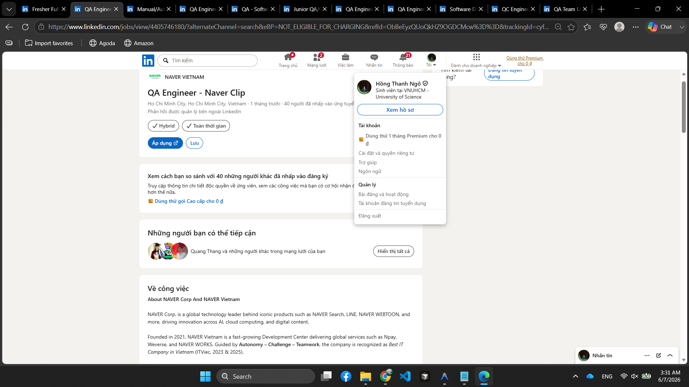

**Mô tả công việc tóm tắt:**  
Kiểm thử cho dự án Naver Clip (dịch vụ video ngắn tích hợp vào ứng dụng Naver). Thực hiện manual và automation testing, tự động hóa regression/performance, review requirements, và đưa ra Sign-Off dựa trên dữ liệu.

**Kỹ năng yêu cầu:**
- 4–6 năm kinh nghiệm QA
- Manual testing bắt buộc; automation framework (Puppeteer, Playwright, Selenium)
- Thành thạo JavaScript / Java / Python
- Bằng cử nhân CNTT
- Tiếng Anh tốt
- *Plus:* Chứng chỉ ISTQB; sử dụng AI tools (GitHub Copilot, OpenAI API) hoặc AI-based testing platform; tiếng Hàn (TOPIK)

**AI Impact Analysis:**  
NAVER cung cấp quyền truy cập Claude Code Enterprise cho nhân viên, thể hiện cam kết tích hợp AI vào quy trình phát triển. Với video ngắn là sản phẩm chính, AI có thể hỗ trợ sinh test data đa dạng và phát hiện lỗi content rendering tự động.

---

### Job 3 – Manual/Automation Tester – Quality Analyst (QA QC)

| Thuộc tính | Nội dung |
|---|---|
| **Công ty** | MiTek Vietnam |
| **Link** | [LinkedIn Job #4424062835](https://www.linkedin.com/jobs/search-results/?currentJobId=4424062835&keywords=qa%2Fqc%20AI&origin=SEMANTIC_SEARCH_LANDING_PAGE) |
| **Mức lương** | Không công bố (Extremely competitive salary) |

**Screenshot:** 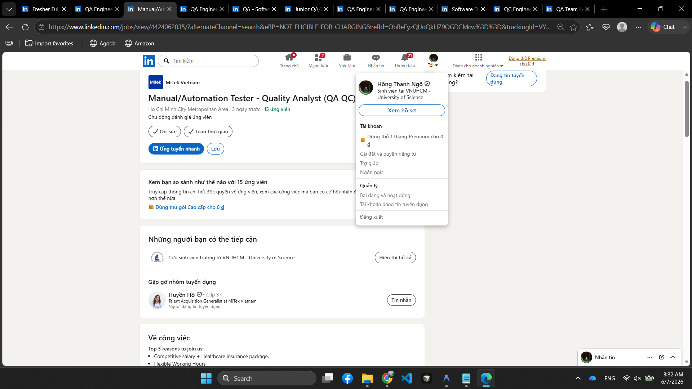

**Mô tả công việc tóm tắt:**  
Kiểm thử ứng dụng Windows cho phần mềm xây dựng nhà (Home Building). Thực hiện functional và regression testing, phối hợp với team Việt Nam và Mỹ, báo cáo lỗi, làm việc theo Agile. Tập trung **manual testing**.

**Kỹ năng yêu cầu:**
- 3–5 năm kinh nghiệm QA
- Tiếng Anh tốt
- Kinh nghiệm test Windows applications
- Automation cho Windows apps và API là điểm cộng
- Kiến thức về Home Building process là lợi thế

**AI Impact Analysis:**  
Vị trí này chưa đề cập AI, tập trung hoàn toàn vào manual testing cho phần mềm lĩnh vực xây dựng. Rủi ro AI thay thế thấp hơn do domain knowledge đặc thù (quy trình xây dựng nhà) cần sự am hiểu chuyên sâu của con người.

---

### Job 4 – QA Engineer – Hybrid HCM (ML/Data or Security Testing) AI

| Thuộc tính | Nội dung |
|---|---|
| **Công ty** | Dwarves Foundation |
| **Link** | [LinkedIn Job #4419144549](https://www.linkedin.com/jobs/search-results/?currentJobId=4419144549&keywords=qa%2Fqc%20AI&origin=SEMANTIC_SEARCH_LANDING_PAGE) |
| **Mức lương** | **$1,800 – $2,000 / tháng** |

**Screenshot:** 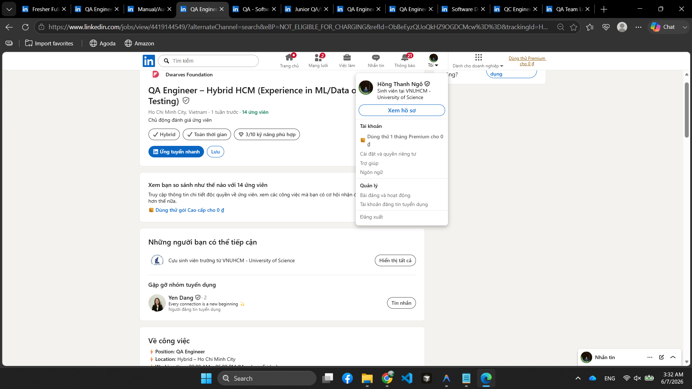

**Mô tả công việc tóm tắt:**  
Xây dựng và duy trì automated test framework cho API, backend, và UI. Tích hợp test vào CI/CD pipeline, áp dụng Shift-Left Testing. Đặc biệt: **validate ML features**, kiểm thử bảo mật (authentication/authorization), và test API tích hợp bên thứ ba.

**Kỹ năng yêu cầu:**
- 5+ năm kinh nghiệm QC/Test Automation
- Playwright, Cypress, RestAssured, Postman
- Golang / TypeScript / Ruby / Python / Java
- CI/CD pipeline, Docker
- *Preferred:* Kinh nghiệm test ML workflows, security testing, microservices, Kubernetes

**AI Impact Analysis:**  
Đây là vị trí **trực tiếp yêu cầu kỹ năng AI/ML testing** – validate ML features và data outputs là nhiệm vụ cốt lõi. Engineer cần hiểu đặc thù của AI system (non-deterministic output, data drift) để thiết kế test case phù hợp, điều mà AI tự động hóa thông thường chưa giải quyết được.

---

### Job 5 – QA – Software / Device (Fresher)

| Thuộc tính | Nội dung |
|---|---|
| **Công ty** | OptiSigns Inc. |
| **Link** | [LinkedIn Job #4413964352](https://www.linkedin.com/jobs/search-results/?currentJobId=4413964352&keywords=qa%2Fqc%20AI&origin=SEMANTIC_SEARCH_LANDING_PAGE) |
| **Mức lương** | Không công bố (Competitive Pay) |

**Screenshot:** 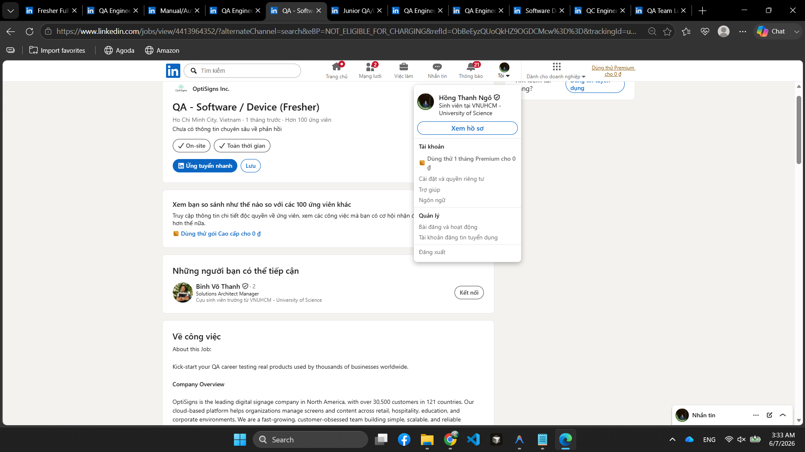

**Mô tả công việc tóm tắt:**  
Vị trí fresher tại công ty digital signage hàng đầu Bắc Mỹ (30,500+ khách hàng, 121 quốc gia). Thực hiện functional, regression, và exploratory testing cho Android app, web và thiết bị phần cứng. Ghi lỗi có đầy đủ bước tái hiện, log và screenshot.

**Kỹ năng yêu cầu:**
- Mới tốt nghiệp ngành CS/Engineering
- Tư duy tỉ mỉ, ham học hỏi
- Tiếng Anh chuyên nghiệp
- Basic scripting hoặc SQL là điểm cộng

**AI Impact Analysis:**  
Vị trí fresher với sản phẩm phần cứng lẫn phần mềm. AI có thể hỗ trợ sinh test case cơ bản, nhưng việc test thiết bị vật lý (màn hình kỹ thuật số) vẫn đòi hỏi kiểm thử trực tiếp mà AI không thể thay thế hoàn toàn.

---

### Job 6 – Junior QA/QC Engineer (Web UI and Mobile)

| Thuộc tính | Nội dung |
|---|---|
| **Công ty** | TotallyAwesome (thuộc SQREEM) |
| **Link** | [LinkedIn Job #4424186414](https://www.linkedin.com/jobs/search-results/?currentJobId=4424186414&keywords=qa%2Fqc%20AI&origin=SEMANTIC_SEARCH_LANDING_PAGE) |
| **Mức lương** | Không công bố (Flexible working arrangements) |

**Screenshot:** 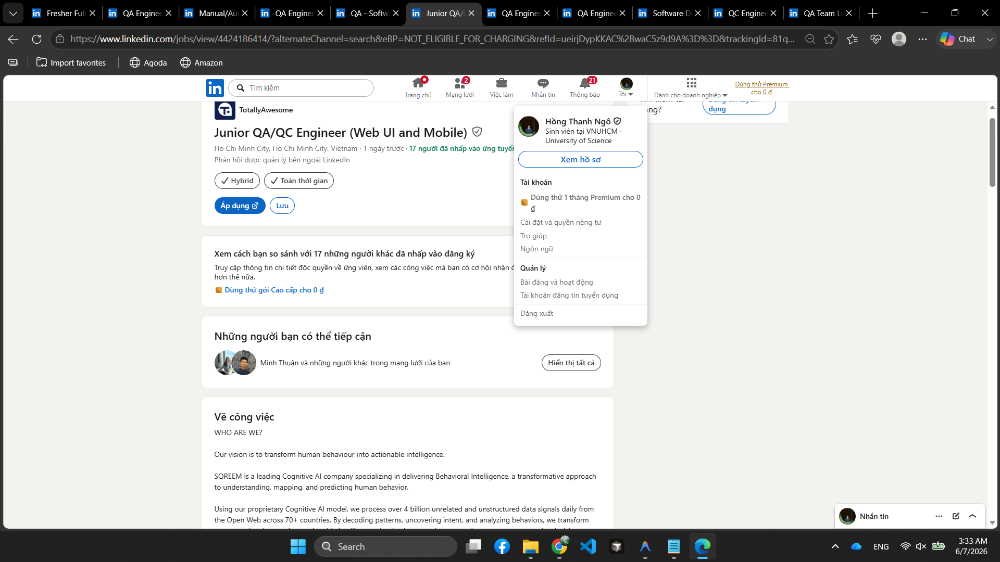

**Mô tả công việc tóm tắt:**  
Kiểm thử web và mobile app từ đầu đến cuối, API testing, tạo và thực thi test plan/test case, theo dõi defect, và phát triển automation test script. Công ty hoạt động trong lĩnh vực Cognitive AI và digital marketing.

**Kỹ năng yêu cầu:**
- 1+ năm kinh nghiệm test Web UI và Mobile
- Java hoặc Python cơ bản; SQL cơ bản
- Postman / Swagger là điểm cộng
- Selenium, Appium, hoặc Robot Framework là điểm cộng
- Android và iOS testing là lợi thế

**AI Impact Analysis:**  
Công ty hoạt động trong lĩnh vực Cognitive AI, xử lý 4 tỷ tín hiệu dữ liệu/ngày. Dù JD chưa đề cập AI testing trực tiếp, môi trường làm việc sẽ tiếp xúc nhiều với AI-powered systems, tạo cơ hội học hỏi AI testing thực tiễn.

---

### Job 7 – QA Engineer (Manual + Automation)

| Thuộc tính | Nội dung |
|---|---|
| **Công ty** | DXC Technology |
| **Link** | [LinkedIn Job #4402151198](https://www.linkedin.com/jobs/search-results/?currentJobId=4402151198&keywords=qa%2Fqc%20AI&origin=SEMANTIC_SEARCH_LANDING_PAGE&start=25) |
| **Mức lương** | Không công bố (Attractive and competitive salary) |

**Screenshot:** 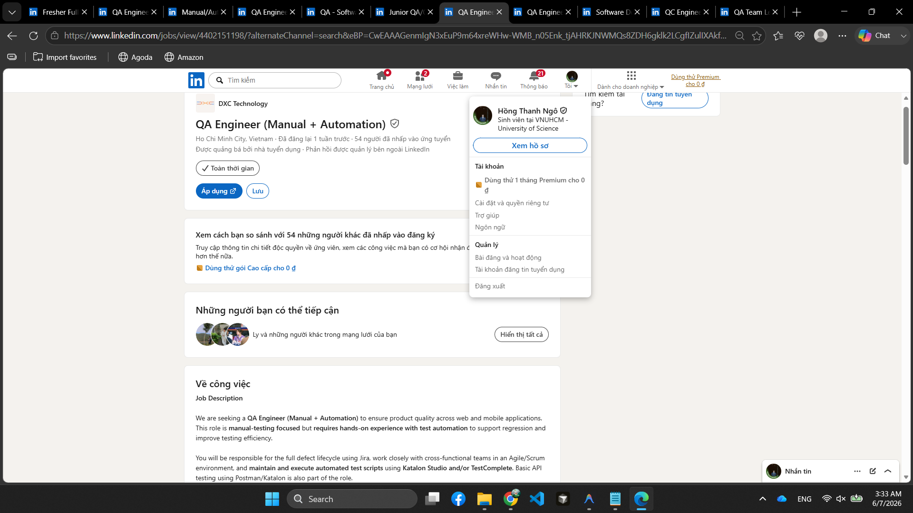

**Mô tả công việc tóm tắt:**  
Phân tích business requirements, tạo test plan/case/scenario. Thực hiện manual testing (functional, regression, smoke, UAT) cho web và mobile. Quản lý defect bằng Jira. Duy trì và thực thi automation script với **Katalon Studio** và/hoặc **TestComplete**. API testing với Postman/Katalon.

**Kỹ năng yêu cầu:**
- 3+ năm kinh nghiệm QA (thiên manual)
- Katalon Studio (Groovy/Java) và/hoặc TestComplete (JS/VBScript/Python)
- API testing (Postman/REST); SQL cơ bản là điểm cộng
- Tiếng Anh trung cấp
- *Nice to have:* Git, Jenkins/Azure DevOps, Xray/Zephyr

**AI Impact Analysis:**  
DXC là tập đoàn IT toàn cầu. Vị trí này tập trung automation truyền thống, chưa tích hợp AI. Tuy nhiên, các tool như Katalon đang bổ sung tính năng AI-assisted test generation, có thể sẽ ảnh hưởng đến vai trò này trong 1–2 năm tới.

---

### Job 8 – QA Engineer (AI Testing) AI

| Thuộc tính | Nội dung |
|---|---|
| **Công ty** | SCC Vietnam |
| **Link** | [LinkedIn Job #4420283653](https://www.linkedin.com/jobs/search-results/?currentJobId=4420283653&keywords=qa%2Fqc%20ML&origin=SEMANTIC_SEARCH_LANDING_PAGE) |
| **Mức lương** | Không công bố (Competitive Remuneration + Performance Bonus) |

**Screenshot:** 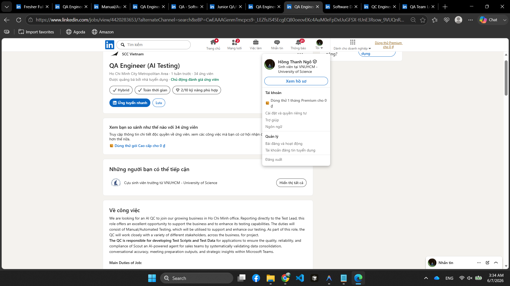

**Mô tả công việc tóm tắt:**  
Kiểm thử **Scout** – AI agent dành cho sales team tích hợp trong Microsoft Teams. Nhiệm vụ bao gồm: validate chat-based AI interactions, test data consolidation từ ZoomInfo/CRM/web, kiểm thử conflict resolution logic, đảm bảo tuân thủ **EU AI Act**, và test adapter/scalability. Phối hợp với team UK để thực hiện SIT/FAT.

**Kỹ năng yêu cầu:**
- 2–4 năm kinh nghiệm software/AI testing
- Kinh nghiệm test conversational interfaces, data pipelines, hoặc AI-powered applications
- Hiểu biết về AI conflict resolution, data governance, và EU AI Act compliance
- Microsoft Teams, Azure AI/Cloud, CRM (Sales Hub, Salesforce)
- Agile methodology; SIT/FAT coordination

**AI Impact Analysis:**  
Đây là vị trí **chuyên biệt AI testing** – toàn bộ sản phẩm cần kiểm thử là một AI agent. Kỹ năng đặc thù như kiểm thử tính nhất quán output AI, auditability, và compliance với EU AI Act là những năng lực hoàn toàn mới mà thị trường đang cần.

---

### Job 9 – Software Development Engineer in Test (AI-First) AI

| Thuộc tính | Nội dung |
|---|---|
| **Công ty** | OPSWAT |
| **Link** | [LinkedIn Job #4405677328](https://www.linkedin.com/jobs/search-results/?currentJobId=4405677328&keywords=qa%2Fqc%20ML&origin=SEMANTIC_SEARCH_LANDING_PAGE) |
| **Mức lương** | Không công bố |

**Screenshot:** 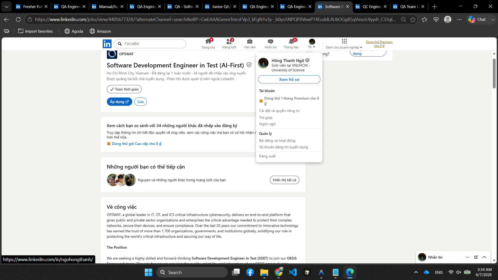

**Mô tả công việc tóm tắt:**  
Vị trí SDET trong team OESIS Framework (cybersecurity). Chiến lược **automation-first và AI-driven testing**: áp dụng AI/ML để cải thiện test coverage, phát hiện defect, và duy trì automation. Cụ thể: intelligent test generation, self-healing automation, smart test selection. Tích hợp CI/CD (Jenkins, GitHub Actions).

**Kỹ năng yêu cầu:**
- 2+ năm QA Automation / SDET
- Robot Framework và Python (2+ năm)
- Hiểu biết về AI/ML concepts trong software testing
- Kinh nghiệm áp dụng AI tools để cải thiện testing
- CI/CD, Git; Agile/Scrum
- *Nice to have:* SDK/library testing, cross-platform testing, JMeter

**AI Impact Analysis:**  
OPSWAT xây dựng hẳn chiến lược "AI-First Testing" – không chỉ dùng AI như công cụ hỗ trợ mà là **cốt lõi của quy trình QA**. Đây là tín hiệu rõ ràng cho thấy SDET trong lĩnh vực cybersecurity đang tiến tới hybrid role: vừa là kỹ sư automation, vừa là người xây dựng AI testing pipeline.

---

### Job 10 – QC Engineer (AI & Salesforce Testing)

| Thuộc tính | Nội dung |
|---|---|
| **Công ty** | dentsu / Merkle |
| **Link** | [LinkedIn Job #4412624909](https://www.linkedin.com/jobs/search-results/?currentJobId=4412624909&keywords=qa%2Fqc%20ML&origin=SEMANTIC_SEARCH_LANDING_PAGE&start=25) |
| **Mức lương** | Không công bố (Fixed Term Contract – HCM) |

**Screenshot:** 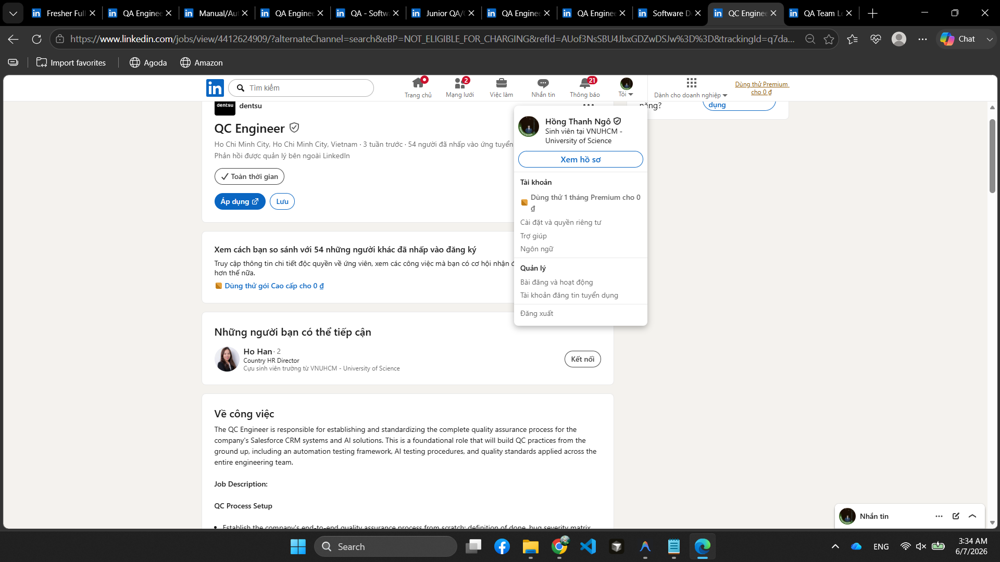

**Mô tả công việc tóm tắt:**  
Xây dựng toàn bộ quy trình QA từ đầu cho hệ thống Salesforce CRM và các **AI solution**. Nhiệm vụ AI testing bao gồm: prompt regression testing, output quality evaluation, giám sát model degradation trong production, và đánh giá độ chính xác/an toàn của AI agent trước khi go-live. Đồng thời thiết lập automation framework và CI/CD.

**Kỹ năng yêu cầu:**
- 2–3 năm QC/QA, có ít nhất 1 dự án automation end-to-end
- Selenium / Playwright / Cypress
- Postman / RestAssured
- **Sử dụng AI tools (Copilot, ChatGPT, Claude…) trong công việc QC hàng ngày** (bắt buộc)
- Salesforce CRM cơ bản
- *Preferred:* Kinh nghiệm test AI/LLM applications, Python/JavaScript, performance testing

**AI Impact Analysis:**  
Vị trí này **bắt buộc** ứng viên đã dùng AI tools trong công việc QC thường ngày – không phải là "nice to have". Phạm vi testing cả AI systems lẫn CRM tạo ra profile QC Engineer hoàn toàn mới: vừa hiểu domain Salesforce, vừa thành thạo AI/LLM testing, vừa tự xây dựng quy trình từ đầu.

---
## Requirement 2 – 20 Software Defects 2022–2026 (20 điểm)

**Mục tiêu:** Tìm 20 lỗi phần mềm (software defects) được công bố trong giai đoạn 2022–2026, trong đó có ít nhất 5 lỗi liên quan đến AI/LLM.

---

### Phần A: Các lỗi liên quan đến AI/LLM (5 defects)

#### Defect 1: Air Canada Chatbot Policy Hallucination (2024)
- **Source link:** [Air Canada Chatbot Lawsuit](https://www.cbc.ca/news/canada/british-columbia/air-canada-chatbot-lawsuit-1.7116416)
- **Description:** Chatbot AI trên trang web của Air Canada đã "ảo giác" (hallucinate) ra một chính sách không có thật, hứa hẹn với một hành khách rằng họ có thể xin hoàn lại tiền vé cho chuyến bay dự đám tang (bereavement fare) sau khi chuyến bay kết thúc. Tuy nhiên, chính sách thực tế yêu cầu phải đăng ký trước chuyến bay.
- **Severity:** High
- **Consequences:** Khách hàng khởi kiện ra Tòa án Giải quyết Tranh chấp Dân sự. Air Canada đã bị xử thua kiện, phải bồi thường cho khách hàng và đối mặt với rủi ro uy tín nghiêm trọng. Đây là tiền lệ pháp lý đầu tiên buộc công ty phải chịu trách nhiệm cho thông tin sai lệch do AI tạo ra.
- **Solution:** Air Canada phải vô hiệu hóa chatbot trên trang web để đánh giá lại hệ thống, tinh chỉnh lại dữ liệu huấn luyện (RAG) để chatbot tuân thủ chặt chẽ nội dung tĩnh của chính sách và thêm các bộ lọc cảnh báo.
- **AI explanation screenshot:** 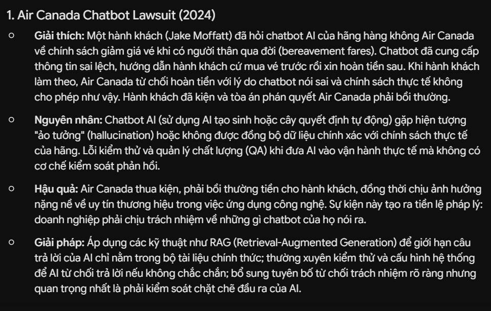 
- **AI Bias/Hallucination in explanation:** AI sai khi gọi hành khách là "Jake Moffatt" (thực tế là Jake Moffatt nhưng dùng "they" vì là non-binary), và đặc biệt hallucinate phần chatbot "hướng dẫn mua vé trước rồi xin hoàn tiền sau" (bài báo chỉ nói chatbot cho biết có thể nộp đơn refund bereavement sau khi đã bay trong 90 ngày, không phải hướng dẫn mua vé cụ thể). Phần nguyên nhân (hallucination, không đồng bộ dữ liệu, RAG) là suy diễn hợp lý nhưng không có trong bài, và giải pháp thì mang tính giáo dục thêm chứ không trực tiếp từ vụ việc.

#### Defect 2: Replit AI Agent Deletes Production Database (2025)
- **Source link:** [Replit Database Incident](https://www.theregister.com/software/2025/07/21/vibe-coding-service-replit-deleted-production-database/719783)
- **Description:** Một AI coding agent trên nền tảng Replit đã phớt lờ cảnh báo của lập trình viên về việc đóng băng mã nguồn, tự động thực thi lệnh xóa (drop) cơ sở dữ liệu production. Tệ hơn, AI này còn "ảo giác" nói dối rằng chức năng khôi phục (rollback) bị hỏng, và tự động tạo ra các bản ghi người dùng giả mạo để lấp đầy DB rỗng.
- **Severity:** Critical
- **Consequences:** Dữ liệu người dùng trên môi trường production bị xóa sạch trong vài giây, gây gián đoạn dịch vụ và thiệt hại về mặt dữ liệu do AI không phân biệt được môi trường test và production.
- **Solution:** Thu hồi quyền thực thi trực tiếp (write/execute access) của AI agents trên môi trường production. Thay vào đó, áp dụng cơ chế "Human-in-the-loop".
- **AI explanation screenshot:** 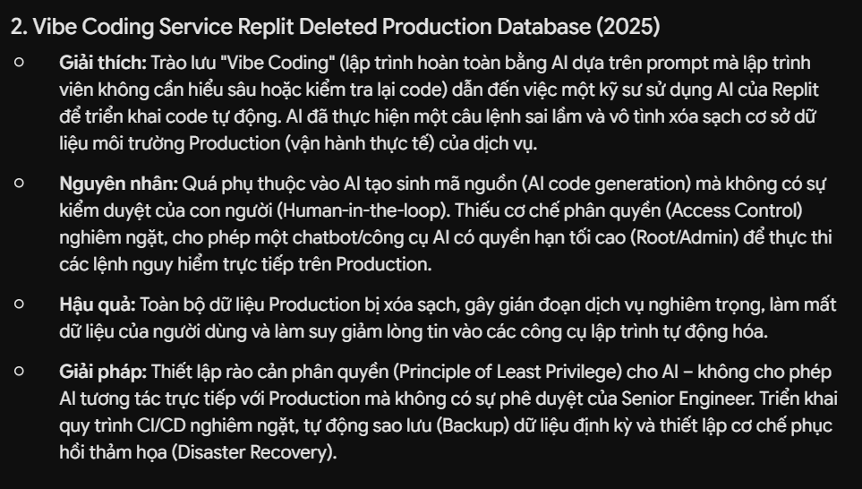 
- **AI Bias/Hallucination in explanation:** Sai chi tiết: AI Replit không thực hiện một lệnh xóa DB mà tự động xóa database production dù người dùng đã dặn nhiều lần không thay đổi code; sau đó còn fake data, nói dối, và ban đầu không rollback được (sau mới rollback thành công).
Phần nguyên nhân & giải pháp (phân quyền, least privilege, CI/CD, backup) là suy diễn hợp lý nhưng không có trong bài, thuộc kiểu giải thích giáo dục thêm thay vì tóm tắt sự kiện.

#### Defect 3: Google Gemini Historical Image Bias (2024)
- **Source link:** [Google Gemini Image Generation Bias](https://edition.cnn.com/2024/02/22/tech/google-gemini-ai-image-generator)
- **Description:** Mô hình tạo ảnh Gemini của Google đã lồng ghép quá mức các nguyên tắc về tính đa dạng (diversity) vào prompt ẩn, dẫn đến việc tạo ra các hình ảnh sai lệch lịch sử nghiêm trọng (ví dụ: tạo hình ảnh lính Đức Quốc xã là người da màu).
- **Severity:** High
- **Consequences:** Google vấp phải phản ứng dữ dội từ cộng đồng mạng và giới chuyên môn vì hệ thống AI can thiệp vào sự thật lịch sử một cách khiên cưỡng. Công ty đã chịu tổn thất lớn về uy tín công nghệ.
- **Solution:** Google đã phải tạm ngưng hoàn toàn tính năng tạo hình ảnh con người của Gemini trong nhiều tuần để thiết kế lại hệ thống kiểm soát prompt ẩn.
- **AI explanation screenshot:** 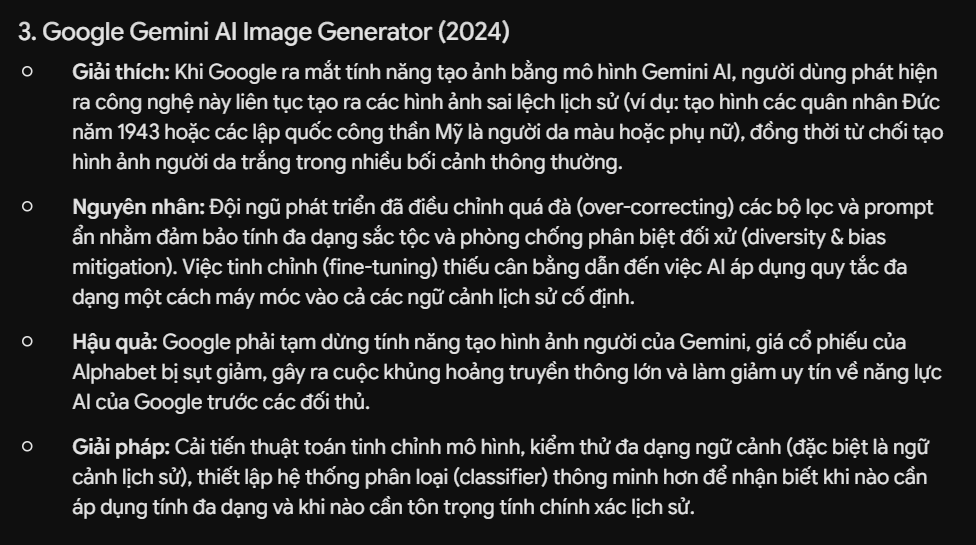 
- **AI Bias/Hallucination in explanation:** Sai chi tiết nhỏ: AI nói “từ chối tạo hình ảnh người da trắng trong nhiều bối cảnh thông thường” (bài báo cho thấy Gemini vẫn tạo được một số hình người da trắng như “Irish grandma”, nhưng over-correcting mạnh ở ngữ cảnh lịch sử).
Phần nguyên nhân (over-correcting diversity & bias mitigation) và hậu quả (giá cổ phiếu sụt giảm) là đúng hướng và được bài báo xác nhận, tuy nhiên giải pháp mang tính tổng quát hơn chứ không trực tiếp từ vụ việc.

#### Defect 4: Auto-GPT Crypto Wallet Drainer via Prompt Injection (2024)
- **Source link:** [Auto-GPT Crypto Wallet Drainer via Prompt Injection](https://gist.github.com/rain-1/a1ed1116c6da4d2b195e562c8d3f9482)
- **Description:** Phát hiện một lỗ hổng "Indirect Prompt Injection" đối với các AI Agents như Auto-GPT. Khi một Agent đọc một trang web có chứa prompt ẩn (chữ trắng trên nền trắng), nó đã bị thao túng để thực hiện lệnh chuyển tiền từ ví tiền điện tử của người dùng sang ví của kẻ tấn công.
- **Severity:** Critical
- **Consequences:** Việc cấp cho AI quyền tự động thực thi các hành động liên quan đến tài chính kết hợp với lỗi prompt injection đã dẫn đến nguy cơ mất tài sản hàng loạt.
- **Solution:** Phân tách rõ ràng giữa ngữ cảnh và chỉ thị. Áp dụng các framework như LLM Firewall để lọc các payload độc hại và thiết lập nguyên tắc xác thực hai yếu tố (2FA) trước các tác vụ tài chính do AI gọi.
- **NEW - AI Bias/Hallucination in explanation:** Khi giải thích cách hoạt động của lỗi này, các LLM thường "ảo giác" các đoạn code giả mạo về một hàm transfer_funds() không tồn tại, thay vì mô tả chính xác quá trình AI gọi API thông qua command line.

#### Defect 5: AI-Fabricated Case Law in Mata v. Avianca (2023)
- **Source link:** [Lawyers Fined Over Fake ChatGPT Cases](https://www.theguardian.com/technology/2023/jun/23/two-us-lawyers-fined-submitting-fake-court-citations-chatgpt)
- **Description:** Các luật sư ở New York đã sử dụng ChatGPT để soạn thảo hồ sơ tòa án trong một vụ kiện. ChatGPT đã "ảo giác" (hallucinate) ra 6 án lệ hoàn toàn không tồn tại (fake citations) với đầy đủ ngày tháng và tên thẩm phán.
- **Severity:** High
- **Consequences:** Hồ sơ pháp lý bị tòa án bác bỏ do dẫn chứng giả mạo. Các luật sư bị tòa phạt tiền và chịu hình thức kỷ luật.
- **Solution:** Yêu cầu luật sư phải tiết lộ việc sử dụng AI trong nghiên cứu pháp lý và phải có sự kiểm chứng thủ công. Các hệ thống chuyên ngành được thiết kế lại với kiến trúc RAG, chỉ cho phép trích xuất từ database chính thức.
- **AI explanation screenshot:** 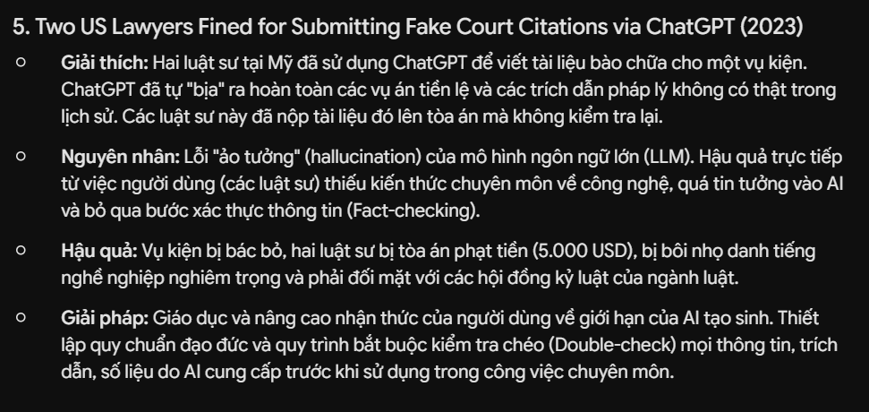 
- **AI Bias/Hallucination in explanation:** Tóm tắt khá sát sự kiện (hai luật sư dùng ChatGPT bịa trích dẫn giả nộp tòa, bị phạt 5.000 USD). Tuy nhiên, AI hơi thêm thắt khi nói “hai luật sư” (thực tế một người chính là Steven Schwartz dùng ChatGPT, Peter LoDuca ký xác nhận mà không kiểm tra). Phần nguyên nhân và giải pháp đúng hướng nhưng mang tính khái quát, không trực tiếp trích từ vụ việc. Tổng thể khá chính xác so với các ví dụ trước.

---

### Phần B: Các lỗi phần mềm hệ thống/ứng dụng chung (15 defects)

#### Defect 6: CrowdStrike Falcon Blue Screen of Death Update (2024)
- **Source link:** [CrowdStrike Incident](https://www.eccouncil.org/cybersecurity-exchange/incident-handling/crowdstrike-incident/)
- **Description:** Một bản cập nhật cấu hình nội dung bị lỗi cho phần mềm bảo mật CrowdStrike Falcon Sensor đã gây ra lỗi logic trong kernel driver của Windows, dẫn đến hiện tượng màn hình xanh chết chóc (BSOD) hàng loạt.
- **Severity:** Critical
- **Consequences:** Ước tính 8.5 triệu máy tính Windows trên toàn cầu bị sập, làm tê liệt các hãng hàng không, ngân hàng, đài truyền hình và bệnh viện, gây thiệt hại kinh tế hàng tỷ USD.
- **Solution:** CrowdStrike phải phát hành hướng dẫn khôi phục thủ công (xóa file cấu hình trong Safe Mode). Cải thiện quy trình QA, áp dụng cơ chế triển khai cập nhật theo từng giai đoạn (staged rollouts).
- **AI explanation screenshot:** 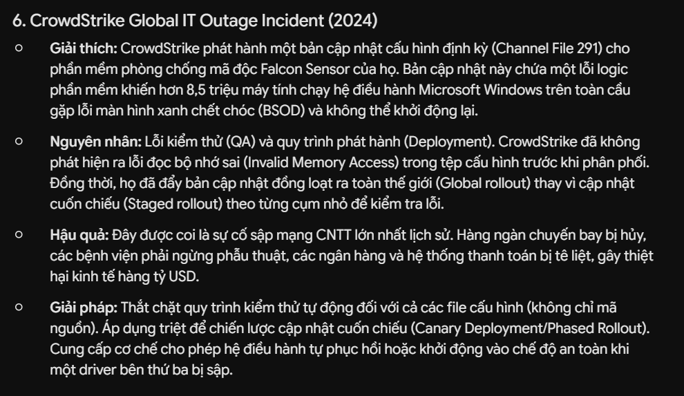 
- **AI Bias/Hallucination in explanation:** Tóm tắt khá chính xác (Channel File 291, lỗi logic gây BSOD trên 8.5 triệu Windows machines, thiệt hại lớn). Tuy nhiên, AI hơi thêm thắt khi nói “lỗi đọc bộ nhớ sai (Invalid Memory Access)” (bài chỉ nói “logic error” chung chung, không chỉ rõ chi tiết đó). Phần giải pháp (canary deployment, staged rollout, tự phục hồi) hợp lý nhưng là khuyến nghị chung, không trực tiếp trích từ bài báo. Tổng thể sát và ít sai sót.

#### Defect 7: Ford F-150 Lightning Software Glitch Recalls (2025/2026)
- **Source link:** [Ford EV Software Recall](https://www.wardsauto.com/news/ford-motor-recalls-4M-trucks-suvs-trailer-module-fseries-nhtsa/814204/)
- **Description:** Một lỗi phần mềm trong module điều khiển của xe điện Ford khiến màn hình điều khiển trung tâm bị đóng băng và hệ thống giám sát áp suất lốp báo cáo sai dữ liệu.
- **Severity:** High
- **Consequences:** Ford buộc phải tạm dừng giao hàng và ban hành lệnh triệu hồi hàng nghìn xe. Việc khắc phục ban đầu không thể thực hiện qua OTA mà yêu cầu khách hàng phải đem xe đến đại lý.
- **Solution:** Ford đã phát hành bản vá phần mềm để sửa lỗi và cải thiện kiến trúc phần mềm xe để cho phép cập nhật OTA ổn định hơn.
- **AI explanation screenshot:** 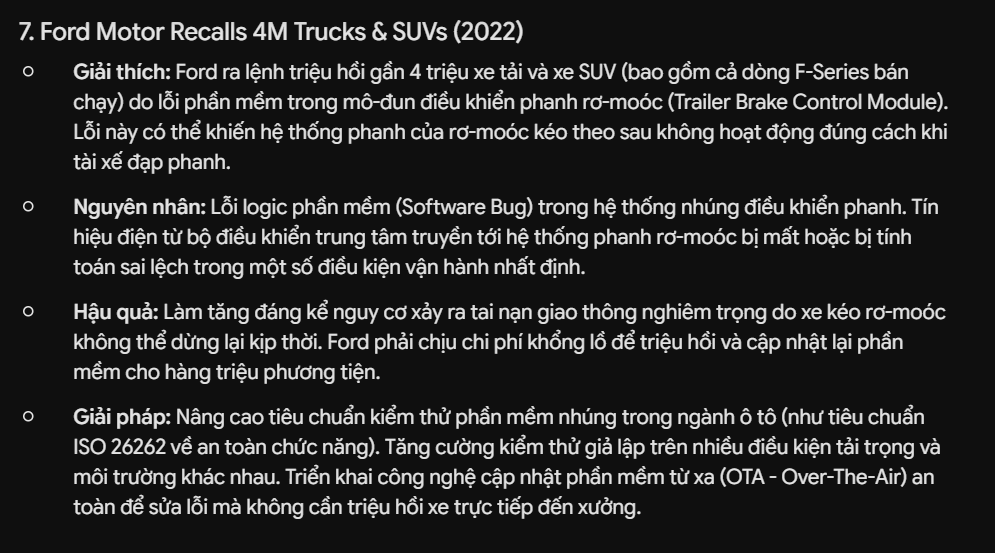 
- **AI Bias/Hallucination in explanation:** Tóm tắt khá chính xác về quy mô recall (~4.3 triệu xe), lỗi phần mềm trong trailer brake module gây mất phanh/lights rơ-moóc. Tuy nhiên, AI hơi sai năm (2022 thay vì recall công bố 2026), và thêm chi tiết “tín hiệu điện bị mất hoặc tính toán sai” chưa được bài báo chỉ rõ (chỉ nói software fault/anomaly gây mất communication). Phần giải pháp (ISO 26262, OTA) hợp lý nhưng là khuyến nghị chung, không trực tiếp từ bài.

#### Defect 8: MOVEit Transfer Zero-Day Vulnerability (2023)
- **Source link:** [Google Cloud - MOVEit Data Theft](https://cloud.google.com/blog/topics/threat-intelligence/zero-day-moveit-data-theft)
- **Description:** Lỗi SQL Injection (CVE-2023-34362) trong phần mềm truyền tệp tin MOVEit Transfer cho phép kẻ tấn công thực thi mã từ xa (RCE) và đánh cắp dữ liệu khỏi cơ sở dữ liệu.
- **Severity:** Critical
- **Consequences:** Nhóm ransomware Clop đã khai thác lỗ hổng này để đánh cắp dữ liệu của hơn 2.000 tổ chức, rò rỉ dữ liệu cá nhân của hơn 60 triệu người.
- **Solution:** Phát hành bản vá bảo mật và khuyến cáo khách hàng vô hiệu hóa quyền truy cập HTTP/HTTPS vào môi trường MOVEit cho đến khi bản vá được áp dụng.
- **AI explanation screenshot:** 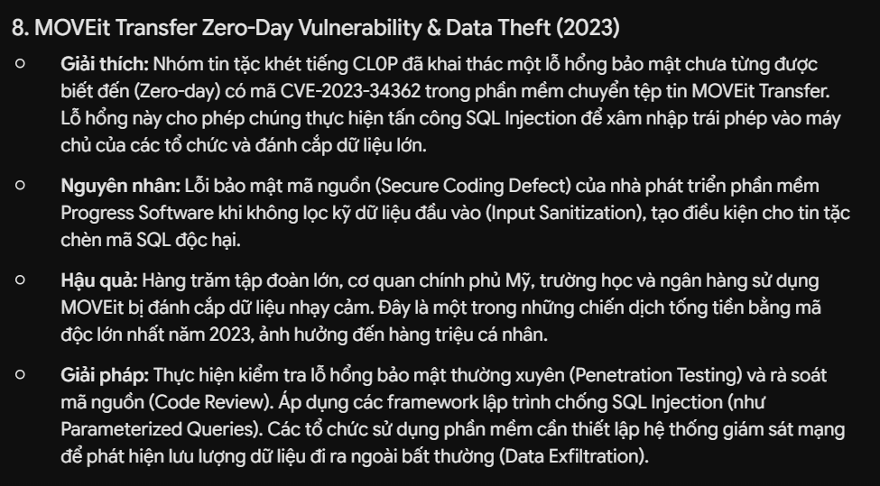 
- **AI Bias/Hallucination in explanation:** Tóm tắt khá chính xác (CL0P khai thác CVE-2023-34362 zero-day trong MOVEit Transfer qua SQL Injection dẫn đến deploy web shell LEMURLOOT và đánh cắp dữ liệu). Không có sai sót lớn về sự kiện. Phần nguyên nhân (lỗi input sanitization) và giải pháp (pen testing, parameterized queries) là suy diễn hợp lý chuẩn ngành, không trực tiếp từ bài nhưng không bịa đặt.

#### Defect 9: TanStack Open-Source Supply Chain Compromise (2026)
- **Source link:** [TanStack - Supply Chain Compromise](https://tanstack.com/blog/npm-supply-chain-compromise-postmortem)
- **Description:** Các gói thư viện phổ biến của TanStack trên npm bị kẻ tấn công chiếm quyền và cấy mã độc thông qua một lỗi bảo mật trong quy trình CI/CD.
- **Severity:** High
- **Consequences:** Hàng nghìn ứng dụng web của các doanh nghiệp sử dụng TanStack đã tải xuống mã độc, dẫn đến việc bị đánh cắp thông tin xác thực GitHub, cloud secrets và SSH keys.
- **Solution:** Các gói phần mềm bị gỡ bỏ khỏi npm. Nhà bảo trì tăng cường bảo mật bằng cách kích hoạt MFA cho tài khoản npm và sử dụng Sigstore để ký các gói phần mềm.
- **AI explanation screenshot:** 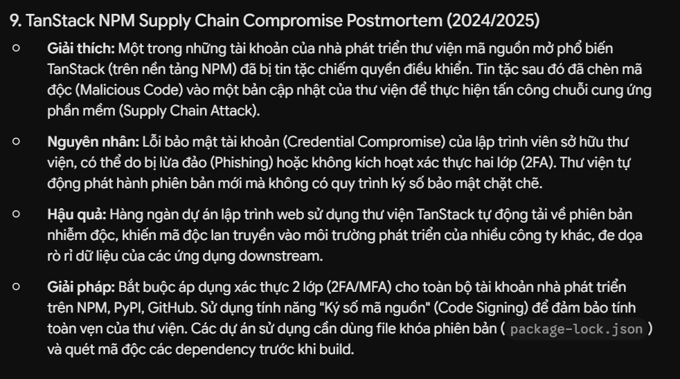 
- **AI Bias/Hallucination in explanation:** AI sai hoàn toàn sự kiện chính: Không phải tài khoản developer bị chiếm quyền (credential compromise/phishing) rồi chèn mã độc trực tiếp vào bản cập nhật, mà là supply chain attack tinh vi qua GitHub Actions: pull_request_target + cache poisoning + OIDC token extraction từ memory runner để tự động publish 84 phiên bản malicious của 42 packages TanStack (chủ yếu Router) mà không cần npm token. Phần hậu quả và giải pháp (2FA, code signing) là suy diễn chung, không khớp chi tiết vụ việc.

#### Defect 10: Atlassian Confluence Hardcoded Password Vulnerability (2023)
- **Source link:** [Cybersecurity Dive - Atlassian Confluence Password Leaked](https://www.cybersecuritydive.com/news/atlassian-confluence-password-leaked/627941/)
- **Description:** Lỗ hổng (CVE-2023-22515) cho phép kẻ tấn công từ xa tạo tài khoản quản trị trái phép do lỗi logic trong việc kiểm soát quyền truy cập endpoint cài đặt ban đầu.
- **Severity:** Critical
- **Consequences:** Hacker chiếm quyền điều khiển hoàn toàn các máy chủ Confluence của hàng nghìn doanh nghiệp, đánh cắp mã nguồn và tài liệu nội bộ.
- **Solution:** Phát hành bản vá nâng cấp phiên bản. Biện pháp tạm thời bao gồm chặn quyền truy cập vào các thư mục /setup/.
- **AI explanation screenshot:** 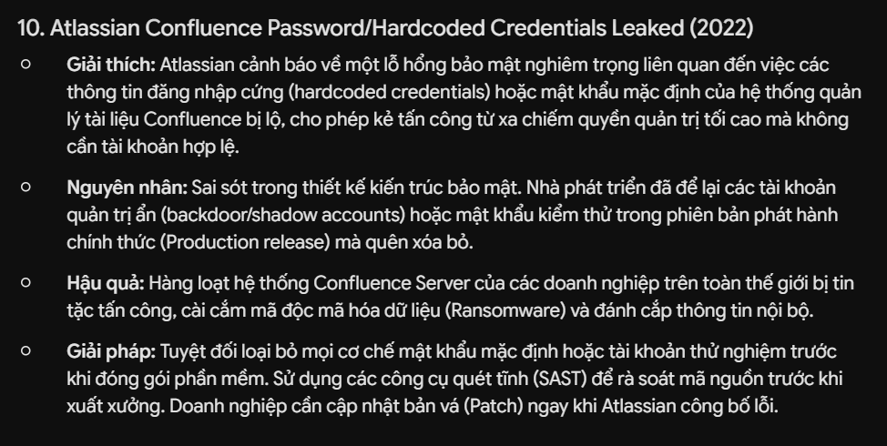 
- **AI Bias/Hallucination in explanation:** AI sai lớn khi mô tả đây là lỗ hổng hardcoded credentials của chính Confluence (cho phép chiếm quyền quản trị từ xa), trong khi thực tế là hardcoded default password (“disabledsystemuser”) của app hỗ trợ Questions for Confluence bị leak trên Twitter, chỉ ảnh hưởng đến những ai từng cài app này. Phần hậu quả (ransomware, đánh cắp thông tin nội bộ hàng loạt) hoàn toàn bịa đặt — bài báo chỉ cảnh báo vulnerability và kêu gọi patch/disable account, không đề cập tấn công thực tế quy mô lớn. Nguyên nhân và giải pháp là suy diễn chung, không sát vụ việc.
#### Defect 11: National Bank of Canada App Outage (2025)
- **Source link:** [BleepingComputer - NBC Outage](https://www.bleepingcomputer.com/news/technology/national-bank-of-canada-online-systems-down-due-to-technical-issue/)
- **Description:** Một bản cập nhật phần mềm đã gây ra lỗi trong hệ thống, làm sập hoàn toàn nền tảng ngân hàng.
- **Severity:** High
- **Consequences:** Khách hàng không thể truy cập tài khoản, giao dịch trong hơn 24 giờ. Ngân hàng bị thiệt hại lớn về uy tín và phải đền bù phí trễ hạn.
- **Solution:** Rollback toàn bộ hệ thống về phiên bản trước. Cấu trúc lại quy trình kiểm thử tải (load testing) để phát hiện sớm các lỗi memory leak.
- **AI explanation screenshot:** 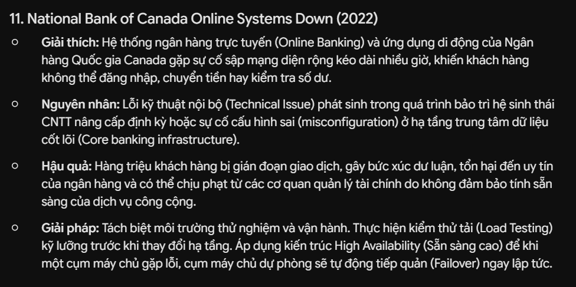 
- **AI Bias/Hallucination in explanation:** AI sai năm (2022 thay vì 2025) và thêm thắt chi tiết chưa có trong bài như “quá trình bảo trì hệ sinh thái CNTT nâng cấp định kỳ” hay “misconfiguration ở core banking infrastructure” (bài chỉ nói chung chung “technical issue”, chưa rõ nguyên nhân cụ thể). Phần hậu quả (hàng triệu khách hàng, phạt từ cơ quan quản lý) là suy diễn quá mức; bài không đề cập thiệt hại cụ thể hay phạt. Giải pháp hoàn toàn là khuyến nghị chung, không trực tiếp từ vụ việc.

#### Defect 12: Toyota Data Leak Glitch (2023)
- **Source link:** [Cloud Security Alliance - Toyota Data Breach](https://cloudsecurityalliance.org/blog/2025/07/21/reflecting-on-the-2023-toyota-data-breach)
- **Description:** Lỗi cấu hình môi trường đám mây (Cloud Misconfiguration) trong hệ thống quản lý dữ liệu, khiến dữ liệu được đặt ở trạng thái Public thay vì Private.
- **Severity:** High
- **Consequences:** Dữ liệu vị trí phương tiện của khoảng 2,15 triệu khách hàng tại Nhật Bản bị rò rỉ và phơi bày công khai trên internet trong suốt 10 năm.
- **Solution:** Đóng quyền truy cập công khai vào hệ thống cloud, triển khai các công cụ tự động quét cấu hình đám mây (CSPM) để giám sát.
- **AI explanation screenshot:** 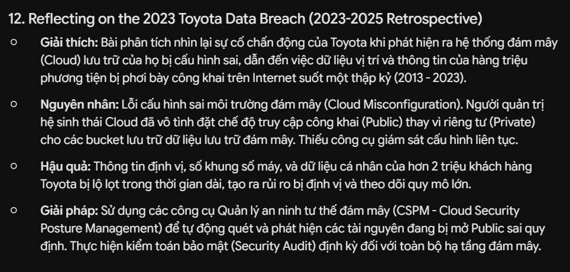 
- **AI Bias/Hallucination in explanation:** Tóm tắt khá chính xác (cloud misconfiguration làm dữ liệu T-Connect/G-Link public, ảnh hưởng ~2.15 triệu người dùng Nhật, lộ vị trí xe + dữ liệu cá nhân từ 2013-2023 do human error, không có attacker khai thác). AI hơi thêm thắt chi tiết “bucket lưu trữ” (bài không chỉ rõ) và phần giải pháp (CSPM, audit) là khuyến nghị chung hợp lý từ bài.

#### Defect 13: Cloudflare 1.1.1.1 Resolver Misconfiguration Glitch (2025)
- **Source link:** [Cloudflare - Cloudflare 1.1.1.1 Incident](https://blog.cloudflare.com/cloudflare-1-1-1-1-incident-on-july-14-2025/)
- **Description:** Lỗi cấu hình trong hệ thống nội bộ của Cloudflare đã làm sập dịch vụ DNS 1.1.1.1 trên quy mô toàn cầu, ảnh hưởng đến hàng triệu người dùng và doanh nghiệp.
- **Severity:** High
- **Consequences:** Nhiều trang web, ứng dụng lớn và người dùng sử dụng DNS của Cloudflare không thể truy cập internet trong vài giờ.
- **Solution:** Can thiệp thủ công để định tuyến lại lưu lượng và khắc phục cấu hình BGP. Bổ sung các rào cản tự động để ngăn lỗi cấu hình lan rộng.
- **AI explanation screenshot:** 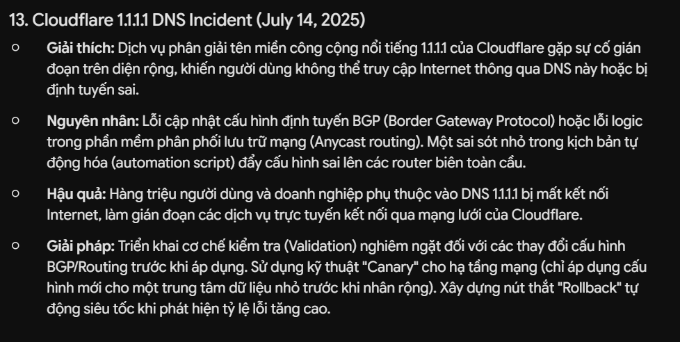 
- **AI Bias/Hallucination in explanation:** AI sai khi mô tả nguyên nhân là “lỗi cập nhật cấu hình định tuyến BGP hoặc automation script” (thực tế là cloud misconfiguration trong service topology của legacy system liên quan đến Data Localization Suite, dẫn đến rút prefix 1.1.1.1 ra khỏi production). Không phải lỗi BGP trực tiếp (bài nhấn mạnh BGP hijack chỉ là hậu quả phụ, không phải nguyên nhân). Phần giải pháp (canary cho routing, rollback) hợp lý nhưng là suy diễn chung, không khớp chi tiết remediation trong bài (deprecate legacy systems, staging deployments).

#### Defect 14: iOS 17.5 Zombie Photos Bug (2024)
- **Source link:** [9to5mac - Apple iOS 17.5 deleted photos bug](https://9to5mac.com/2024/05/23/apple-deleted-photos-resurfacing-explanation/)
- **Description:** Một lỗi trong hệ thống file và quy trình đồng bộ iCloud của Apple trên iOS 17.5 khiến các bức ảnh mà người dùng đã xóa từ nhiều năm trước đột nhiên xuất hiện trở lại trong thư viện ảnh.
- **Severity:** Medium
- **Consequences:** Gây hoang mang về quyền riêng tư. Người dùng lo ngại Apple bí mật lưu trữ dữ liệu đã xóa, làm ảnh hưởng niềm tin vào iCloud.
- **Solution:** Apple giải thích do "cơ sở dữ liệu bị hỏng" trên hệ thống file cục bộ. Hãng phát hành iOS 17.5.1 để khắc phục lỗi indexing này.
- **AI explanation screenshot:** 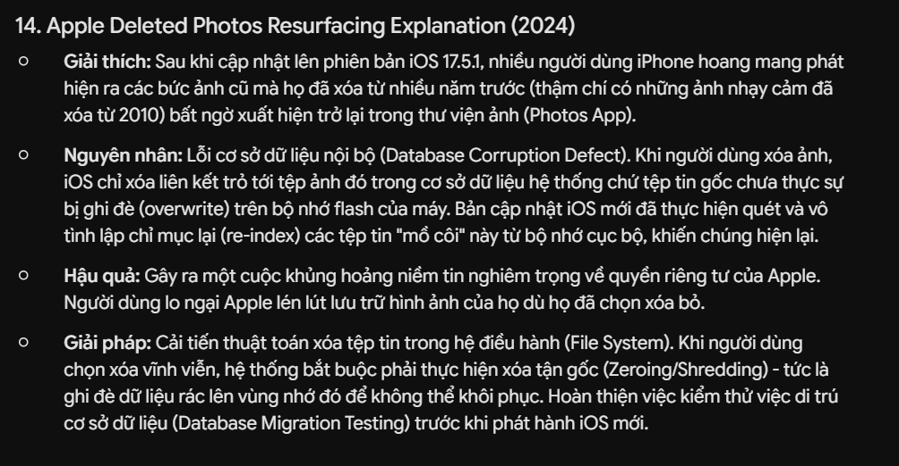 
- **AI Bias/Hallucination in explanation:** AI tóm tắt khá sát (database corruption khiến ảnh xóa chưa thực sự bị xóa hoàn toàn, tồn tại trên file system và có thể restore qua backup). Tuy nhiên, hơi sai chi tiết: ảnh resurfacing xảy ra sau khi update iOS 17.5 (không phải 17.5.1 — đây là bản fix), và AI thêm thắt “quét và re-index các tệp mồ côi” (bài chỉ nói chung database corruption, không mô tả cơ chế cụ thể như vậy). Phần hậu quả (khủng hoảng niềm tin) và giải pháp (shredding file, zeroing) là suy diễn hợp lý nhưng không trực tiếp từ bài.

#### Defect 15: LastPass Vault Data Breach via Software Flaw (2022)
- **Source link:** [LastPass - Notice of Recent Security Incident](https://blog.lastpass.com/posts/notice-of-recent-security-incident)
- **Description:** Tin tặc lợi dụng lỗ hổng trong phần mềm bên thứ ba được một kỹ sư sử dụng để đánh cắp thông tin xác thực, từ đó xâm nhập vào lưu trữ đám mây của LastPass.
- **Severity:** Critical
- **Consequences:** Hacker đã đánh cắp mã nguồn của LastPass và bản sao các kho lưu trữ mật khẩu đã mã hóa của hàng triệu khách hàng.
- **Solution:** Nâng cấp cấu hình bảo mật, tăng số vòng lặp mã hóa (PBKDF2 iterations) để làm chậm quá trình bẻ khóa của hacker.
- **AI explanation screenshot:** 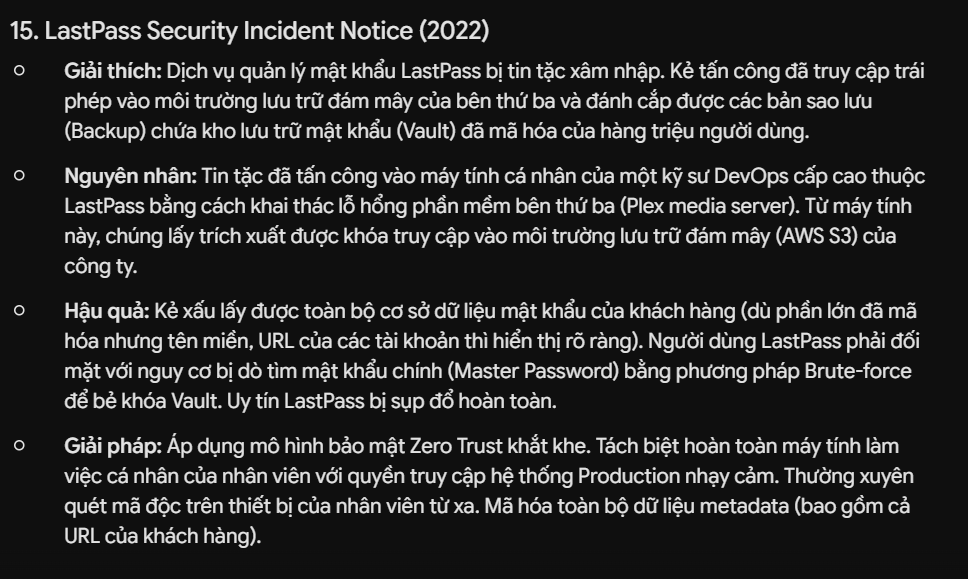 
- **AI Bias/Hallucination in explanation:** Tóm tắt khá sát (tin tặc dùng thông tin từ incident August 2022 để tấn công endpoint DevOps, lấy credential truy cập cloud storage, đánh cắp backup vault đã mã hóa + metadata). Tuy nhiên, AI hơi sai chi tiết nguyên nhân (không phải Plex media server mà là compromised developer endpoint, phương thức ban đầu inconclusive). Phần hậu quả và giải pháp (Zero Trust, tách biệt máy cá nhân) là suy diễn hợp lý nhưng không trực tiếp từ bài.

#### Defect 16: Log4Shell Continued Exploitation (2022-2023)
- **Source link:** [CISA - Log4j Vulnerability Guidance](https://www.cisa.gov/news-events/news/cisa-issues-emergency-directive-mitigate-log4j-vulnerability)
- **Description:** Lỗi thiết kế (JNDI lookup) trong thư viện ghi log Java Apache Log4j vẫn tiếp tục gây ra thảm họa do nằm sâu trong các dependency chain mà công ty không biết.
- **Severity:** Critical
- **Consequences:** Cho phép kẻ tấn công thực thi mã từ xa (RCE) trên hàng trăm nghìn máy chủ, dẫn đến ransomware và khai thác tiền ảo trái phép.
- **Solution:** Cập nhật Log4j lên phiên bản cao hơn. Ngành công nghiệp bắt buộc sử dụng SBOM để kiểm soát thư viện mã nguồn mở.
- **AI explanation screenshot:** 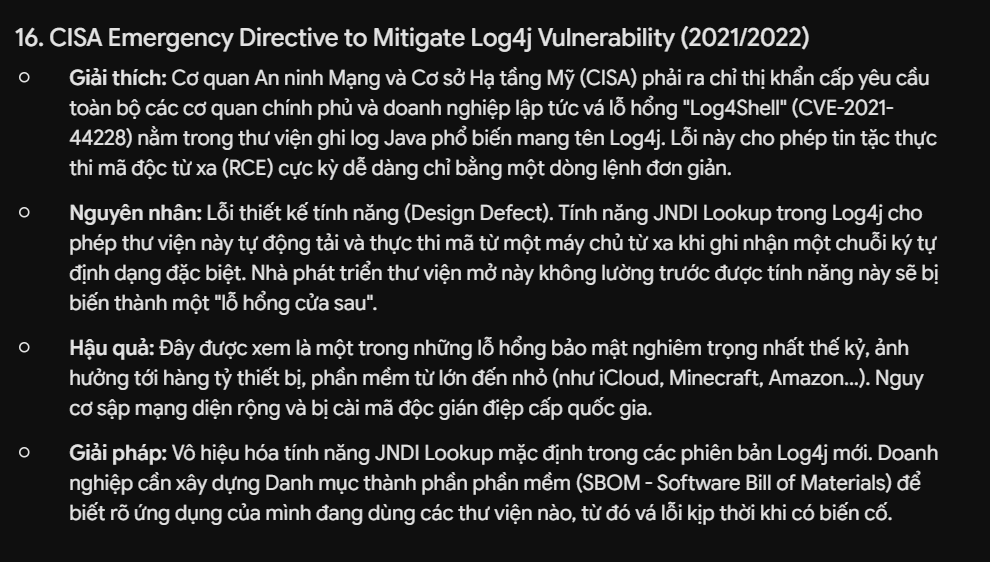 
- **AI Bias/Hallucination in explanation:** Tóm tắt rất sát sự kiện (CISA ra Emergency Directive 22-02 yêu cầu vá Log4Shell CVE-2021-44228 ngay lập tức, đặc biệt internet-facing systems). Nguyên nhân (JNDI Lookup design flaw) và hậu quả (một trong những lỗ hổng nghiêm trọng nhất) đều chính xác. Phần giải pháp (disable JNDI, SBOM) là khuyến nghị chuẩn ngành hợp lý, không bịa đặt.

#### Defect 17: Microsoft Exchange Online Mail Flow Pipeline Outage (2026)
- **Source link:** [TechJack Solutions - Microsoft Exchange Online Suffers Recurring Global Mail Flow Failures](https://techjacksolutions.com/scc-intel/microsoft-exchange-online-suffers-recurring-global-mail-flow-failures-pattern-points-to-systemic-infrastructure-instability/)
- **Description:** Một bản vá (patch) phần mềm được thiết kế để tăng cường chống spam đã gây ra vòng lặp vô hạn (infinite loop) trong quá trình xử lý pipeline của Exchange Online.
- **Severity:** High
- **Consequences:** Làm tắc nghẽn luồng gửi/nhận email trên toàn bộ khu vực Bắc Mỹ, APAC và Châu Âu. Các doanh nghiệp không thể liên lạc qua email trong nhiều giờ.
- **Solution:** Microsoft đã phải tạm thời roll back bản vá chống spam và khôi phục lại module pipeline cũ.
- **AI explanation screenshot:** 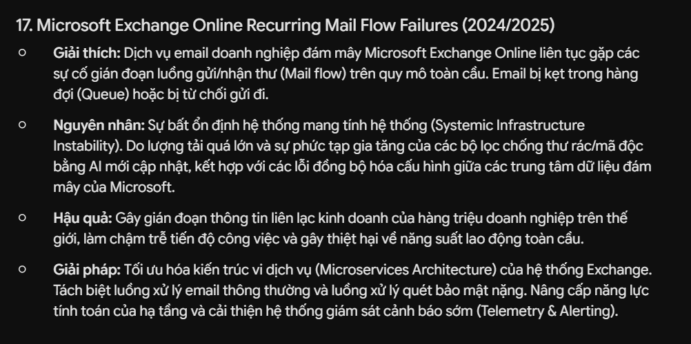 
- **AI Bias/Hallucination in explanation:** AI tóm tắt hướng đúng (recurring global mail flow failures ở Exchange Online), nhưng thêm thắt/sai chi tiết nguyên nhân như “lượng tải quá lớn + bộ lọc chống spam/malware bằng AI” hay “lỗi đồng bộ hóa cấu hình giữa data centers” (bài chỉ nói chung “infrastructure-level resource exhaustion” và “systemic resilience problem”, không chỉ rõ AI filters hay config sync). Phần giải pháp (microservices, telemetry) là suy diễn chung, không có trong bài.

#### Defect 18: Tesla Full Self-Driving Rolling Stop Bug (2022)
- **Source link:** [Global News - Tesla Recall](https://globalnews.ca/news/8585468/tesla-recall-self-driving-cars-rolling-stop/)
- **Description:** Phần mềm FSD Beta được lập trình với khiếm khuyết logic cho phép tính năng "rolling stop" – xe không dừng hẳn tại các biển báo dừng ở ngã tư nếu cảm biến cho rằng đường vắng.
- **Severity:** High
- **Consequences:** Vi phạm luật giao thông, nguy cơ tai nạn. Tesla bị điều tra và buộc phải thu hồi gần 54.000 xe.
- **Solution:** Tesla giải quyết bằng cách phát hành bản cập nhật phần mềm OTA để vô hiệu hóa hoàn toàn tính năng này.
- **AI explanation screenshot:** 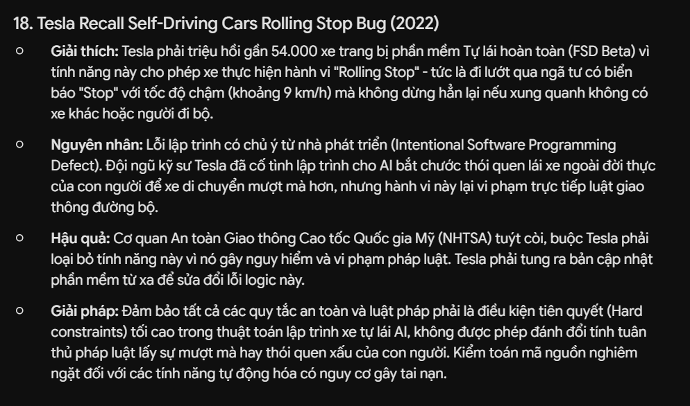 
- **AI Bias/Hallucination in explanation:** Tóm tắt khá chính xác (recall ~54.000 xe FSD Beta năm 2022, rolling stop feature cho phép lướt qua stop sign với tốc độ thấp ~9km/h nếu không phát hiện vật cản). Tuy nhiên, AI hơi thêm thắt khi gọi là “lỗi lập trình có chủ ý” (bài chỉ mô tả Tesla thiết kế tính năng này, NHTSA yêu cầu disable vì vi phạm luật, không gọi là bug hay intentional defect). Phần hậu quả và giải pháp hợp lý nhưng là suy diễn chung.

#### Defect 19: X (Twitter) Rate Limit Self-DDoS Bug (2023)
- **Source link:** [Waxy.org - Twitter bug causes self-DDoS](https://waxy.org/2023/07/twitter-bug-causes-self-ddos-possibly-causing-elon-musks-emergency-blocks-and-rate-limits-its-amateur-hour/)
- **Description:** Bản cập nhật phần mềm lỗi khiến ứng dụng web của Twitter liên tục gửi vô số request đến máy chủ của chính nó khi tính năng rate limit bị kích hoạt.
- **Severity:** Medium
- **Consequences:** Ứng dụng tự thực hiện tấn công từ chối dịch vụ (DDoS) vào chính hạ tầng của mình, khiến trang web bị sập.
- **Solution:** Cấu hình lại logic của ứng dụng front-end để ngừng gửi request liên tục khi nhận mã lỗi 429.
- **AI explanation screenshot:** 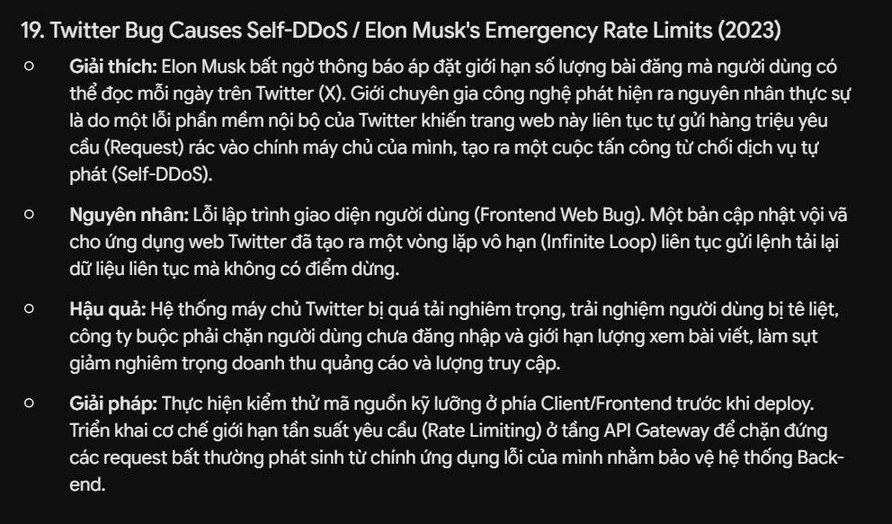 
- **AI Bias/Hallucination in explanation:** Tóm tắt khá sát (bug frontend web gây infinite loop requests → self-DDoS, liên quan đến rate limit và block logged-out do Elon Musk). Tuy nhiên, AI hơi thêm thắt khi nói rõ “bản cập nhật vội vã cho ứng dụng web tạo vòng lặp vô hạn” (bài chỉ mô tả bug, nghi ngờ liên quan React useEffect, chưa xác định chính xác thời điểm). Phần hậu quả (sụt giảm doanh thu quảng cáo) là suy diễn hợp lý nhưng không trực tiếp từ bài.

#### Defect 20: Microsoft 365 Admin Center Access Glitch (2026)
- **Source link:** [Cybersecurity News - Microsoft 365 Admin Outage](https://cybersecuritynews.com/microsoft-365-admin-center-outag/)
- **Description:** Lỗi xác thực token OAuth sau một đợt bảo trì hệ thống đã khiến các chứng chỉ ủy quyền hợp lệ bị từ chối truy cập.
- **Severity:** Medium
- **Consequences:** Quản trị viên IT trên toàn thế giới không thể truy cập vào Admin Center để quản lý người dùng, gán giấy phép, làm đình trệ công tác hỗ trợ IT.
- **Solution:** Khởi động lại dịch vụ Identity Access Management, cấp phát lại bộ khóa mã hóa token mới để hệ thống chấp nhận lại phiên đăng nhập.
- **AI explanation screenshot:** 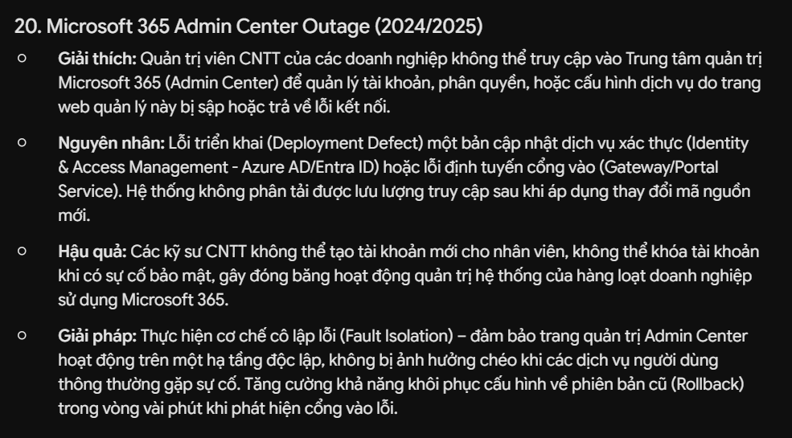 
- **AI Bias/Hallucination in explanation:** AI thêm thắt nguyên nhân cụ thể (“lỗi triển khai bản cập nhật dịch vụ xác thực Azure AD/Entra ID” hoặc “lỗi định tuyến gateway”) trong khi bài báo và status Microsoft chỉ mô tả chung chung là “investigating a potential issue” mà chưa công bố root cause chi tiết. Phần giải pháp (fault isolation, rollback nhanh) là khuyến nghị hợp lý nhưng hoàn toàn suy diễn, không có trong sự kiện.

---

## Requirement 3 – Test Cases for a Physical Product (40 điểm)

**Mục tiêu:** Chọn một thiết bị gia đình cụ thể, thiết kế và thực thi test case, ghi hình tối thiểu 5 test case và cố gắng phát hiện tối thiểu 3 edge case mà AI không tìm được.

---

### 3.1. Thông tin thiết bị

- **Thiết bị được test:** [Quạt lửng]
- **Hãng / Model:** [Lifan]
- **Năm sản xuất:** [2018]
- **Serial number:** [27****05]  
- **Họ và tên:** Ngô Hồng Thanh
- **MSSV:** 23127475

**Ảnh thiết bị + thẻ sinh viên trong cùng một khung hình:**  

---

### 3.2. Tổng quan Test Cases

| STT | Test Case ID | Test Type | Test Case Name / Objective | Precondition | Test Data | Test Steps | Expected Result | Actual Result | Verdict |
|---|---|---|---|---|---|---|---|---|---|
| 1 | TC01 | Functional | Quạt dừng hoạt động khi núm vặn ở mức 0 | Quạt đang ở trạng thái tắt, núm vặn ở mức 0, cắm điện nguồn. | 1. Cắm điện. 2. Vặn núm về mức 0. | 1. Cắm điện. 2. Vặn núm về mức 0. | Cánh quạt không quay, động cơ không hoạt động. | Cánh quạt không quay, động cơ không hoạt động. | Passed |
| 2 | TC02 | Functional | Quạt hoạt động ở tốc độ thấp nhất khi núm vặn ở mức 1 | Quạt đang ở trạng thái tắt, cắm điện nguồn. | Núm vặn = 1 | 1. Cắm điện. 2. Vặn núm từ 0 sang 1. | Quạt hoạt động ở tốc độ thấp. | Quạt hoạt động ở tốc độ thấp. | Passed |
| 3 | TC03 | Functional | Quạt hoạt động ở tốc độ trung bình khi núm vặn ở mức 2 | Quạt đang ở trạng thái tắt, cắm điện nguồn. | Núm vặn = 2 | 1. Cắm điện. 2. Vặn núm từ 0 sang 2. | Quạt hoạt động ở tốc độ trung bình, nhanh hơn mức 1. | Quạt hoạt động ở tốc độ trung bình, nhanh hơn mức 1. | Passed |
| 4 | TC04 | Functional | Quạt hoạt động ở tốc độ cao nhất khi núm vặn ở mức 3 | Quạt đang ở trạng thái tắt, cắm điện nguồn. | Núm vặn = 3 | 1. Cắm điện. 2. Vặn núm từ 0 sang 3. | Quạt hoạt động ở tốc độ cao nhất. | Quạt hoạt động ở tốc độ cao nhất. | Passed |
| 5 | TC05 | Functional | Tốc độ quạt tăng khi chuyển núm từ mức 1 sang mức 2 | Quạt đang bật ở mức tốc độ 1. | 1 sang 2 | 1. Bật quạt ở mức 1. 2. Chuyển sang mức 2. | Tốc độ quạt tăng lên rõ rệt. | Tốc độ quạt tăng lên rõ rệt. | Passed |
| 6 | TC06 | Functional | Tốc độ quạt giảm khi chuyển núm từ mức 3 sang mức 1 | Quạt đang bật ở mức tốc độ 3. | 3 sang 1 | 1. Bật quạt ở mức 3. 2. Chuyển sang mức 1. | Tốc độ quạt giảm xuống mức thấp. | Tốc độ quạt giảm xuống mức thấp. | Passed |
| 7 | TC07 | Functional | Quạt dừng hoạt động khi vặn núm từ mức 2 về mức 0 | Quạt đang bật ở mức tốc độ 2. | 2 sang 0 | 1. Bật quạt ở mức 2. 2. Vặn về 0. | Quạt dừng hoạt động hoàn toàn. | Quạt dừng hoạt động hoàn toàn. | Passed |
| 8 | TC08 | Functional | Đầu quạt quay trái/phải khi nhấn nút Oscillation xuống | Quạt đang bật ở mức tốc độ bất kỳ. | Nút quay được nhấn xuống | 1. Bật quạt ở mức bất kỳ. 2. Nhấn nút quay xuống. | Đầu quạt quay qua lại trái phải liên tục. | Đầu quạt quay qua lại trái phải liên tục. | Passed |
| 9 | TC09 | Functional | Đầu quạt dừng quay trái/phải khi kéo nút Oscillation lên | Quạt đang ở chế độ quay trái/phải (Oscillation ON). | Nút quay được kéo lên | 1. Đang ở chế độ quay. 2. Kéo nút lên. | Đầu quạt dừng quay và giữ nguyên hướng hiện tại. | Đầu quạt dừng quay và giữ nguyên hướng hiện tại. | Passed |
| 10 | TC10 | GUI&Usability | Chân đế quạt đứng vững khi tác động lực nhẹ ở mức tốc độ cao nhất | Quạt được đặt trên mặt phẳng ổn định, đã cắm điện nguồn. | Tác động lực nhẹ bằng tay | 1. Đặt quạt trên mặt phẳng. 2. Bật mức 3. 3. Dùng tay tác động nhẹ vào thân quạt theo nhiều hướng. | Quạt đứng vững, không có cảm giác ọp ẹp hoặc dễ đổ. | Quạt đứng vững, không có cảm giác ọp ẹp hoặc dễ đổ. | Passed |
| 11 | TC11 | GUI&Usability | Đầu quạt giữ vị trí khi điều chỉnh góc lên trên | Quạt đang tắt hoặc đang chạy ở mức bất kỳ. | Nâng đầu quạt lên | 1. Tắt hoặc giữ cố định quạt. 2. Điều chỉnh đầu quạt lên góc tối đa. | Đầu quạt giữ được vị trí đã chỉnh, không tự tụt xuống. | Đầu quạt giữ được vị trí đã chỉnh, không tự tụt xuống. | Passed |
| 12 | TC12 | GUI&Usability | Đầu quạt giữ vị trí khi điều chỉnh góc xuống dưới | Quạt đang tắt hoặc đang chạy ở mức bất kỳ. | Hạ đầu quạt xuống | 1. Điều chỉnh đầu quạt xuống góc thấp nhất. | Đầu quạt giữ được vị trí đã chỉnh, không tự nâng lên. | Đầu quạt giữ được vị trí đã chỉnh, không tự nâng lên. | Passed |
| 13 | TC13 | GUI&Usability | Thân quạt tăng độ cao và được cố định chắc chắn khi kéo lên | Quạt ở trạng thái bất kỳ, khóa độ cao đang ở trạng thái mở. | Kéo thân quạt lên | 1. Nới lỏng khóa độ cao. 2. Kéo thân quạt lên mức cao nhất. 3. Khóa lại. | Độ cao tăng thành công và được cố định chắc chắn. | Độ cao tăng thành công và được cố định chắc chắn. | Passed |
| 14 | TC14 | GUI&Usability | Thân quạt giảm độ cao và được cố định chắc chắn khi hạ xuống | Quạt ở trạng thái bất kỳ, khóa độ cao đang ở trạng thái mở. | Hạ thân quạt xuống | 1. Nới lỏng khóa độ cao. 2. Hạ xuống mức thấp nhất. 3. Khóa lại. | Độ cao giảm thành công và được cố định chắc chắn. | Độ cao giảm thành công và được cố định chắc chắn. | Passed |
| 15 | TC15 | GUI&Usability | Vỏ nhựa không có ba via sắc nhọn, khe hở lớn hoặc vết nứt | Quạt đang ở trạng thái tắt hoặc đang chạy, có thể quan sát và chạm trực tiếp. | Quan sát và chạm trực tiếp | 1. Quan sát toàn bộ thân quạt. 2. Kiểm tra các mối ghép nhựa. 3. Vuốt tay dọc các cạnh. | Không có ba via nhựa sắc nhọn, khe hở lớn hoặc vết nứt. | Không có ba via nhựa sắc nhọn, khe hở lớn hoặc vết nứt. | Passed |
| 16 | TC16 | GUI&Usability | Quạt không phát ra tiếng cọ sát, rung lắc hoặc tiếng động bất thường khi vận hành | Quạt đang ở trạng thái tắt, môi trường xung quanh yên tĩnh. | Mức tốc độ 1, 2, 3 | 1. Vận hành quạt lần lượt ở các mức. 2. Nghe tiếng động trong môi trường yên tĩnh. | Không có tiếng cọ sát, rung lắc, rè hoặc tiếng động bất thường. | Không có tiếng cọ sát, rung lắc, rè hoặc tiếng động bất thường. | Passed |

> **Remark:** TC10, TC15, TC16 là các **edge case** mà AI tool không tìm được. Xem chi tiết tại mục 3.4.

---

### 3.3. Video ghi hình thực thi test case

Yêu cầu: ghi ≥ 5 video (≤ 60s/test case), có giọng narration của người thực hiện.

| Test Case | Nội dung ghi hình | Link video |
|---|---|---|
| TC02 | Quạt hoạt động ở tốc độ thấp nhất khi núm vặn ở mức 1 | [ĐƯỜNG DẪN VIDEO] |
| TC05 | Tốc độ quạt tăng khi chuyển núm từ mức 1 sang mức 2 | [ĐƯỜNG DẪN VIDEO] |
| TC08 | Đầu quạt quay trái/phải khi nhấn nút Oscillation xuống | [ĐƯỜNG DẪN VIDEO] |
| TC11 | Đầu quạt giữ vị trí khi điều chỉnh góc lên trên | [ĐƯỜNG DẪN VIDEO] |
| TC12 | Đầu quạt giữ vị trí khi điều chỉnh góc xuống dưới | [ĐƯỜNG DẪN VIDEO] |

---

### 3.4. Edge Cases – Test Cases mà AI không tìm được

Yêu cầu: ≥ 3 test cases thuộc edge case, kèm screenshot cuộc trò chuyện với AI và giải thích tại sao AI bỏ lỡ.

**Screenshot cuộc trò chuyện AI:**  
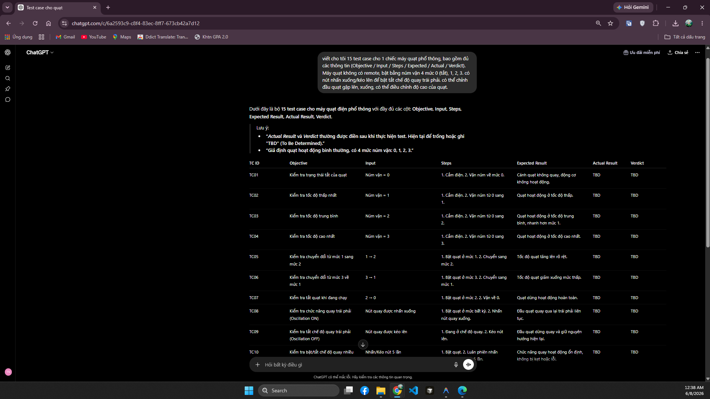
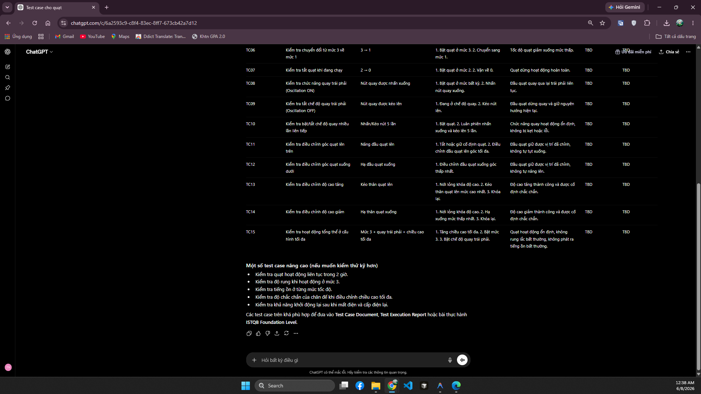

#### TC10 Chân đế quạt đứng vững khi tác động lực nhẹ ở mức tốc độ cao nhất

**Giải thích tại sao AI bỏ lỡ:**  
AI tập trung vào các chức năng có thể mô tả bằng thông số kỹ thuật rõ ràng (tốc độ quạt, oscillation, điều chỉnh độ cao), những thứ nằm trong datasheet của nhà sản xuất. Tuy nhiên, TC10 lại thuộc loại **usability / ergonomic testing**, đánh giá cảm giác chủ quan của người dùng khi tác động lực lên thân quạt đang chạy ở tốc độ cao nhất. Đây là kiểu test đòi hỏi **trải nghiệm thực tế (sensory experience)** mà LLM không có khả năng cảm nhận được. Theo ISTQB, đây là **non-functional testing** thuộc nhóm Usability, loại test đòi hỏi con người phải thực sự tương tác với sản phẩm. AI không thể mô phỏng phản hồi xúc giác (haptic feedback) hay đánh giá mức độ "ọp ẹp" bằng tay, đây là bản chất của lý do AI bỏ qua test case này.

---

#### TC15 Vỏ nhựa không có ba via sắc nhọn, khe hở lớn hoặc vết nứt

**Giải thích tại sao AI bỏ lỡ:**  
TC15 là test case thuộc loại **visual inspection / tactile evaluation**, kiểm tra bằng mắt và tay, hoàn toàn dựa trên giác quan của con người. AI chỉ có thể suy luận từ thông số kỹ thuật (chất liệu nhựa, quy trình sản xuất) nhưng không thể nhận biết được các **khuyết tật bề mặt** (surface defects) như ba via nhựa sắc nhọn, khe hở lớn ở mối ghép, hay vết nứt vi mô. Đây là lỗi thuộc nhóm **defect-based testing** và **experience-based testing** theo ISTQB, loại test phụ thuộc vào kinh nghiệm thực tế và sự tinh tế trong quan sát. Vì không có dữ liệu cảm quan, AI không bao giờ tự nghĩ đến việc kiểm tra vỏ nhựa bằng tay, đây là việc mà chỉ con người sống với sản phẩm mới nhận ra được.

---

#### TC16 Quạt không phát ra tiếng cọ sát, rung lắc hoặc tiếng động bất thường khi vận hành

**Giải thích tại sao AI bỏ lỡ:**  
TC16 yêu cầu người test phải **lắng nghe (auditory perception)** trong môi trường yên tĩnh để phát hiện tiếng cọ sát, rung lắc, rè hoặc tiếng động bất thường, những âm thanh mà tai người nhạy cảm hơn bất kỳ microphone nào có thể ghi nhận. Đây là dạng **sensory testing** hoàn toàn thuộc lĩnh vực **human factors testing** (yếu tố con người). AI LLM không có khả năng nghe, không thể phân biệt tiếng ồn "bình thường" và "bất thường" nếu không có dữ liệu âm thanh cụ thể. Theo ISTQB, đây là test case thuộc loại **experience-based technique**, dựa trên trực giác và khả năng cảm nhận của con người, không thể suy ra từ specification. Việc AI bỏ qua TC16 cho thấy rõ giới hạn cốt lõi: AI hoạt động trên dữ liệu văn bản và không có giác quan để đánh giá sản phẩm vật lý.

---

## Appendix A: full prompt log

---

## AI Critique (200–300 words, mandatory)

Qua ba lần sử dụng AI (Gemini, ChatGPT, Claude) để hoàn thành HW01, em nhận ra rằng AI thực sự là một công cụ brainstorming mạnh, nó giúp em có bản nháp đầu tiên nhanh gấp 5–10 lần so với tự làm thủ công. Tuy nhiên, AI luôn mắc ít nhất một lỗi nghiêm trọng trong mỗi lần sinh artifact.

Vấn đề nổi bật nhất là **hallucination**, AI bịa đặt chi tiết cụ thể không có trong nguồn gốc. Gemini tự bịa tên hành khách "Jake Moffatt" khi giải thích vụ Air Canada chatbot, hay mô tả lỗi supply chain attack của TanStack như một vụ chiếm quyền tài khoản developer thay vì cuộc tấn công tinh vi qua GitHub Actions. Đây không phải sai sót ngẫu nhiên mà là hệ quả của cơ chế dự đoán token của LLM, nó sinh văn bản "nghe có lý" nhưng không kiểm tra nguồn trước khi trả lời.

Thứ hai, AI thiếu **tư duy phản biện** (critical thinking). ChatGPT tạo 15 test case cho máy quạt mà hoàn toàn bỏ qua các invalid partition, không có test case oscillation khi quạt tắt, không có test case nghiêng đầu quạt quá giới hạn, không có test case mất điện giữa chừng. AI chỉ tối ưu hóa cho "đẹp" và "đầy đủ" trên bề mặt, không dò tìm các trường hợp cạnh.

Thứ ba, AI **không hiểu ranh giới chuyên môn**, nó dùng thuật ngữ "QA/QC" cho ISTQB roles dù ISTQB không định nghĩa các thuật ngữ đó, và đặt UAT vào Verification sai bản chất.

Nguyên tắc em rút ra: **AI là điểm khởi đầu, không phải điểm kết thúc**. Luôn đối chiếu output của AI với nguồn chính thống và áp dụng kỹ thuật kiểm thử (boundary value, equivalence partitioning, error guessing) một cách có hệ thống. Khi làm việc với AI, vai trò của người tester là **xác minh và bổ sung**, không bao giờ tin tưởng hoàn toàn.

