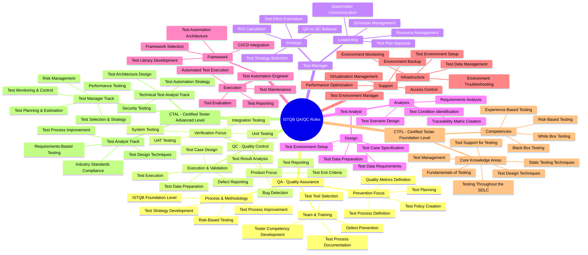

# ISTQB QA/QC Role Mindmap

## Overview
This mindmap illustrates the key roles and responsibilities in Software Testing based on the ISTQB (International Software Testing Qualifications Board) framework, covering both **Quality Assurance (QA)** and **Quality Control (QC)** functions.

---

## Mindmap



---

## Role Summary Table

| Role | Focus | Key Responsibilities | ISTQB Level |
|------|-------|---------------------|-------------|
| **Test Manager** | Strategy & Leadership | Test planning, resource management, stakeholder management | Advanced |
| **Test Analyst** | Design & Analysis | Requirements analysis, test case design, traceability | Foundation / Advanced |
| **Test Automation Engineer** | Tool & Automation | Framework development, script creation, CI/CD | Specialist |
| **Test Environment Manager** | Infrastructure | Environment setup, data management, monitoring | Support Role |
| **QA Engineer** | Process & Prevention | Process definition, improvement, quality metrics | Foundation / Advanced |
| **QC Engineer** | Product & Detection | Test execution, defect reporting, validation | Foundation |

---

## QA vs QC Comparison

| Aspect | QA (Quality Assurance) | QC (Quality Control) |
|--------|----------------------|---------------------|
| **Focus** | Process & Prevention | Product & Detection |
| **Goal** | Prevent defects | Find and report defects |
| **Approach** | Proactive | Reactive |
| **Activities** | Process improvement, standards | Testing, inspection, review |
| **When** | Throughout lifecycle | During execution phase |
| **Output** | Process documentation, metrics | Test reports, defect logs |

---

## ISTQB Certification Pathway

```
Foundation Level (CTFL)
├── Entry point for all testers
├── 40 hours study recommended
└── Valid for life (no expiry)

    ├── Advanced Level (CTAL)
    │   ├── Test Manager
    │   ├── Test Analyst
    │   └── Technical Test Analyst
    │
    └── Specialist Certifications
        ├── Test Automation Engineer
        ├── Agile Tester
        ├── Security Tester
        └── Performance Tester
```

---

## Key Takeaways

- **QA** focuses on **process improvement** and **prevention** of defects
- **QC** focuses on **product validation** and **detection** of defects
- ISTQB provides a **structured certification pathway** from Foundation to Expert level
- Both QA and QC are **complementary** and essential for software quality
- The **Test Manager** oversees both QA and QC activities
- **Test Automation** is a specialized role within the QA/QC framework