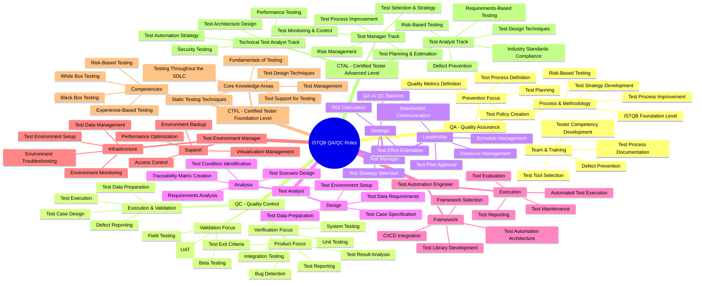

# ISTQB Testing Roles Mindmap

## Overview
This mindmap illustrates the key roles and responsibilities in Software Testing based on the ISTQB (International Software Testing Qualifications Board) framework.

> **Note on QA vs QC:** ISTQB Foundation Level (CTFL 4.0) does not define "QA Role" or "QC Role" as formal certification roles. Instead, it defines **Test Management Role** and **Testing Role**. QA (Quality Assurance) and QC (Quality Control) are **quality concepts** — QA focuses on **process & prevention**, while QC focuses on **product & detection**. They are complementary and are embedded within the roles below, not standalone ISTQB roles.

---

## Mindmap



---

## Role Summary Table

| Role | Focus | Key Responsibilities | ISTQB Level |
|------|-------|---------------------|-------------|
| **Test Manager** | Strategy & Leadership | Test planning, resource management, stakeholder management | Advanced |
| **Test Analyst** | Design & Analysis | Requirements analysis, test case design, traceability | Foundation / Advanced |
| **Test Automation Engineer** | Tool & Automation | Framework development, script creation, CI/CD | Specialist |
| **Test Environment Manager** | Infrastructure | Environment setup, data management, monitoring | Support Role |
| **Technical Test Analyst** | Architecture & Non-Functional | Test architecture, performance, security, automation strategy | Advanced |

---

## QA vs QC Comparison

| Aspect | QA (Quality Assurance) | QC (Quality Control) |
|--------|----------------------|---------------------|
| **Focus** | Process & Prevention | Product & Detection |
| **Goal** | Prevent defects | Find and report defects |
| **Approach** | Proactive | Reactive |
| **Activities** | Process improvement, standards | Testing, inspection, review |
| **When** | Throughout lifecycle | During execution phase |
| **Output** | Process documentation, metrics | Test reports, defect logs |

---

## ISTQB Certification Pathway

```
Foundation Level (CTFL)
├── Entry point for all testers
├── 40 hours study recommended
└── Valid for life (no expiry)

    ├── Advanced Level (CTAL)
    │   ├── Test Manager
    │   ├── Test Analyst
    │   └── Technical Test Analyst
    │
    └── Specialist Certifications
        ├── Test Automation Engineer
        ├── Agile Tester
        ├── Security Tester
        └── Performance Tester
```

---

## Key Takeaways

- **ISTQB defines two primary roles:** Test Management Role and Testing Role — not "QA" or "QC" as standalone roles
- **QA** (process & prevention) and **QC** (product & detection) are quality concepts embedded within testing roles, not separate ISTQB-certified roles
- **Verification** ("building the product right") applies to unit, integration, and system testing
- **Validation** ("building the right product") is the primary goal of UAT and acceptance testing
- ISTQB provides a **structured certification pathway** from Foundation to Expert level
- The **Test Manager** oversees testing activities; the **Test Analyst** focuses on test analysis and design
- **Test Automation** is a specialized role within the testing framework