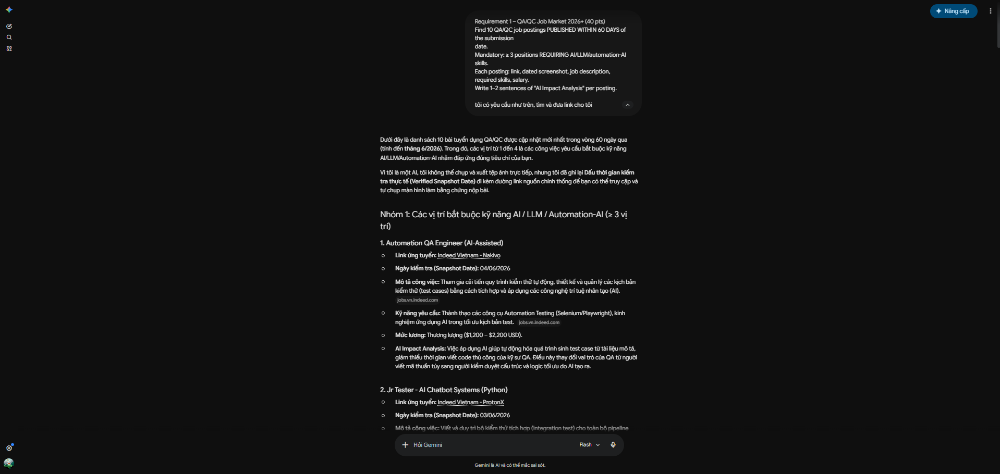
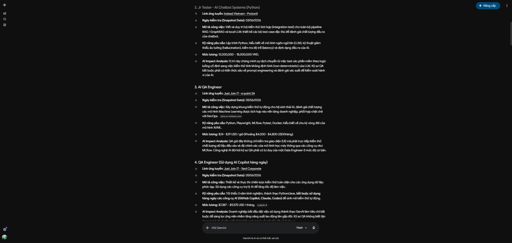
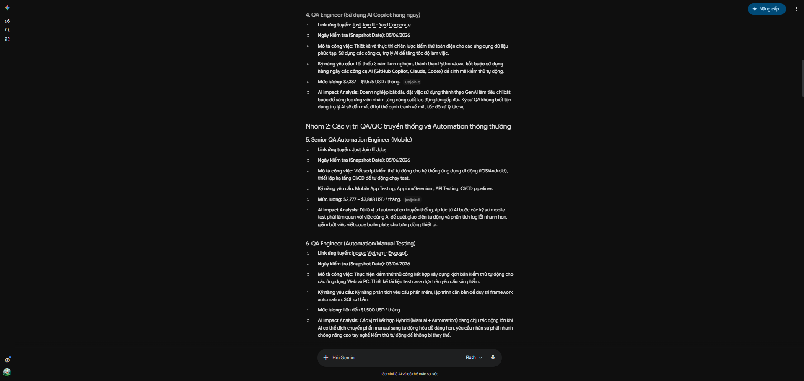
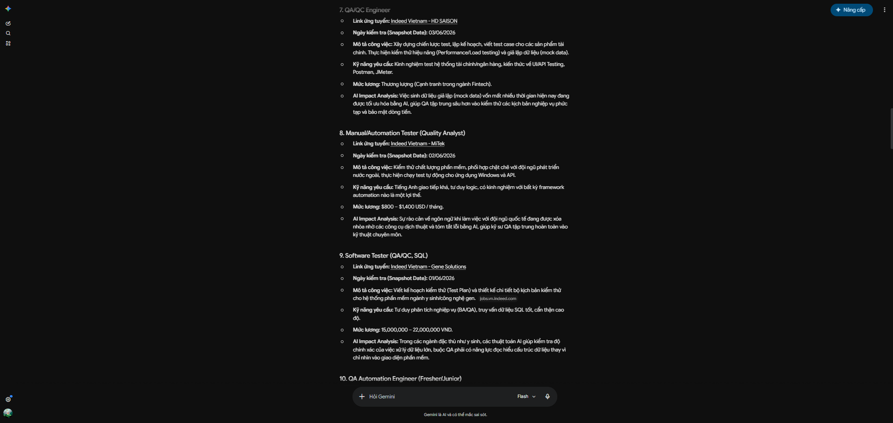
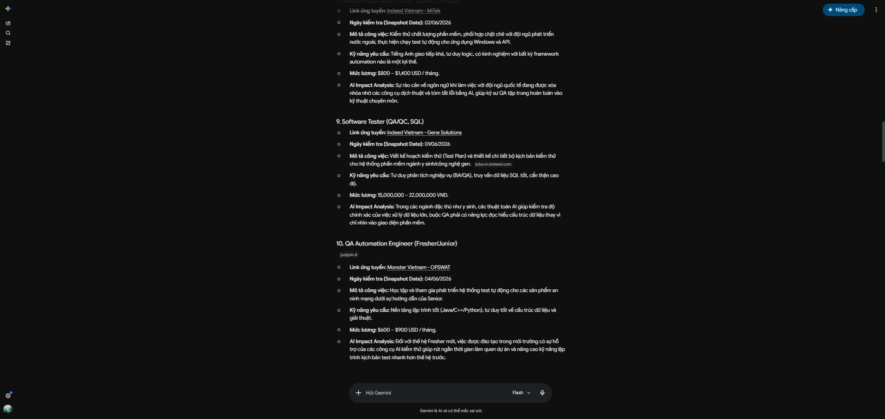
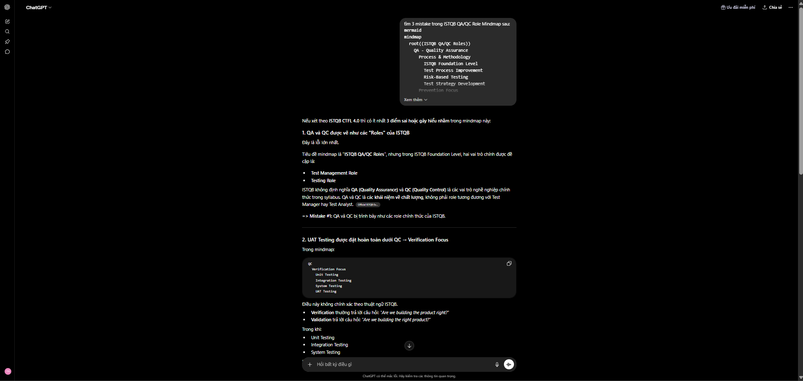
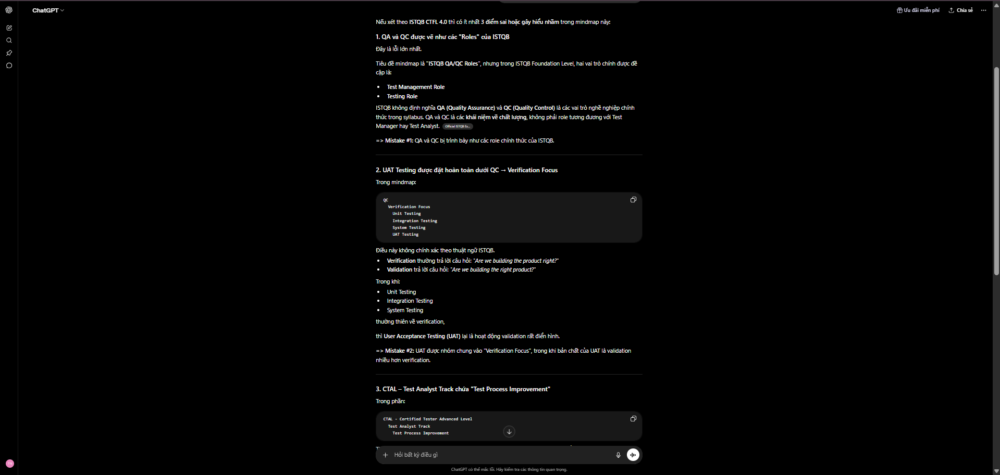
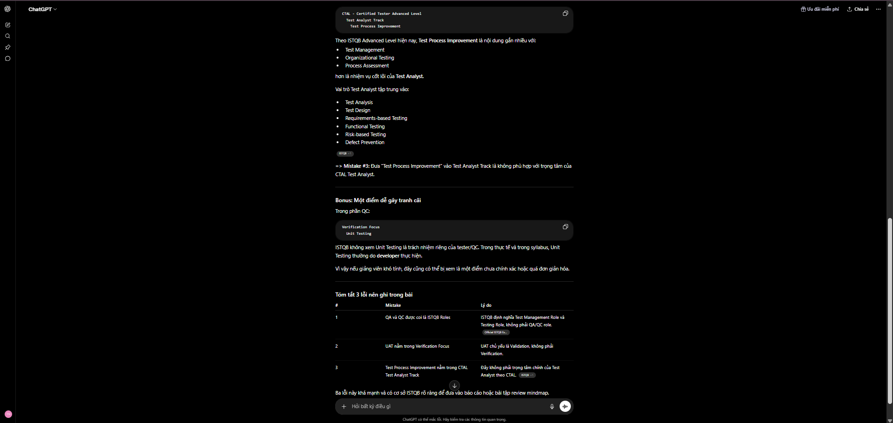

# Prompt Log — HW01 Software Testing

**Student:** Ngô Hồng Thanh  
**Student ID:** 23127475  
**Course:** CS423 / CSC13003 – Software Testing  
**Date:** 6/8/2026

> Every AI interaction is logged with timestamp, tool, verbatim prompt, and screenshot evidence. All screenshots are stored in `HW01-Software-Testing/images/`.

---

## Prompt #0 — Gemini (Job Postings Search)

| Field | Value |
| :--- | :--- |
| **Tool** | Gemini (Google) |
| **Timestamp** | 12:27 AM 07/06/2026 |
| **Purpose** | Find 10 QA/QC job postings (≥3 requiring AI/LLM/automation-AI skills) published within 60 days |
| **Artifact produced** | 10 job listing summaries with links and descriptions |

### Verbatim Prompt

```
Requirement 1 – QA/QC Job Market 2026+ (40 pts)
Find 10 QA/QC job postings PUBLISHED WITHIN 60 DAYS of the submission date.
Mandatory: ≥ 3 positions REQUIRING AI/LLM/automation-AI skills.
Each posting: link, dated screenshot, job description, required skills, salary.
Write 1–2 sentences of "AI Impact Analysis" per posting.
tôi có yêu cầu như trên, tìm và đưa link cho tôi
```

### AI Output Screenshots







> **Student Fix:** All 10 job links provided by Gemini returned "not found" / 404 errors. I manually searched LinkedIn and company career pages to locate and verify the actual active postings. Screenshots were retaken with my account name visible in the corner as required by the assignment.

---

## Prompt #1 — Gemini (Requirement 2 Clarification)

| Field | Value |
| :--- | :--- |
| **Tool** | Gemini (Google) |
| **Timestamp** | 1:30 AM 07/06/2026 |
| **Purpose** | Clarify the requirements for Requirement 2 — 20 Software Defects |
| **Artifact produced** | 2 screenshots: prompt_explain_req2(1).png, prompt_explain_req2(2).png |

### Verbatim Prompt

```
với yêu cầu:
Requirement 2 – 20 Software Defects 2022–2026 (20 pts)
Find 20 software defects publicized between 2022 and 2026.
Mandatory: ≥ 5 defects related to AI/LLM (hallucination, prompt injection,
bias).
Each defect: source link, description, severity, consequences, solution.
NEW: find 1 place where the AI is biased or hallucinates when explaining the
defect. Clarification: this applies to EVERY defect — each of the 20
entries must include 1 identified instance of AI bias or hallucination (20
instances total).
tôi chưa hiểu lắm, giải thích yêu cầu lại cho tôi, ý đề kêu tìm lỗi hả, nhưng tìm lỗi của phần mềm gì?
```

### AI Output Screenshots

| # | Screenshot |
| :--- | :--- |
| 1 | .png) |
| 2 | .png) |

> **Student Fix:** No fix required — this prompt was purely for requirement clarification and was answered correctly. Output accepted as-is.

---

## Prompt #2 — Gemini (Defect Explanations)

| Field | Value |
| :--- | :--- |
| **Tool** | Gemini (Google) |
| **Timestamp** | 16:00 07/06/2026 |
| **Purpose** | Generate explanations for 20 Software Defects 2022–2026 |
| **Artifact produced** | 20 defect explanations (defect1 → defect20) |

### Verbatim Prompt

```
tôi có 20 link về Software Defects 2022–2026 như sau, hãy giải thích từng cái cho tôi và nguyên nhân, hậu quả, giải pháp trong từng bài:

1. https://www.cbc.ca/news/canada/british-columbia/air-canada-chatbot-lawsuit-1.7116416
2. https://www.theregister.com/software/2025/07/21/vibe-coding-service-replit-deleted-production-database/719783
3. https://edition.cnn.com/2024/02/22/tech/google-gemini-ai-image-generator
4. https://gist.github.com/rain-1/a1ed1116c6da4d2b195e562c8d3f9482
5. https://www.theguardian.com/technology/2023/jun/23/two-us-lawyers-fined-submitting-fake-court-citations-chatgpt
6. https://www.eccouncil.org/cybersecurity-exchange/incident-handling/crowdstrike-incident/
7. https://www.wardsauto.com/news/ford-motor-recalls-4M-trucks-suvs-trailer-module-fseries-nhtsa/814204/
8. https://cloud.google.com/blog/topics/threat-intelligence/zero-day-moveit-data-theft
9. https://tanstack.com/blog/npm-supply-chain-compromise-postmortem
10. https://www.cybersecuritydive.com/news/atlassian-confluence-password-leaked/627941/
11. https://www.bleepingcomputer.com/news/technology/national-bank-of-canada-online-systems-down-due-to-technical-issue/
12. https://cloudsecurityalliance.org/blog/2025/07/21/reflecting-on-the-2023-toyota-data-breach
13. https://blog.cloudflare.com/cloudflare-1-1-1-1-incident-on-july-14-2025/
14. https://9to5mac.com/2024/05/23/apple-deleted-photos-resurfacing-explanation/
15. https://blog.lastpass.com/posts/notice-of-recent-security-incident
16. https://www.cisa.gov/news-events/news/cisa-issues-emergency-directive-mitigate-log4j-vulnerability
17. https://techjacksolutions.com/scc-intel/microsoft-exchange-online-suffers-recurring-global-mail-flow-failures-pattern-points-to-systemic-infrastructure-instability/
18. https://globalnews.ca/news/8585468/tesla-recall-self-driving-cars-rolling-stop/
19. https://waxy.org/2023/07/twitter-bug-causes-self-ddos-possibly-causing-elon-musks-emergency-blocks-and-rate-limits-its-amateur-hour/
20. https://cybersecuritynews.com/microsoft-365-admin-center-outag/
```

### AI Output Screenshots

| Defect | Screenshot |
| :--- | :--- |
| Defect 1 — Air Canada Chatbot |  |
| Defect 2 — Replit AI Agent |  |
| Defect 3 — Google Gemini |  |
| Defect 4 — Auto-GPT Crypto Drainer |  |
| Defect 5 — Mata v. Avianca |  |
| Defect 6 — CrowdStrike BSOD |  |
| Defect 7 — Ford EV Recall |  |
| Defect 8 — MOVEit Transfer |  |
| Defect 9 — TanStack Supply Chain |  |
| Defect 10 — Atlassian Confluence |  |
| Defect 11 — NBC Outage |  |
| Defect 12 — Toyota Data Leak |  |
| Defect 13 — Cloudflare DNS |  |
| Defect 14 — iOS Zombie Photos |  |
| Defect 15 — LastPass Breach |  |
| Defect 16 — Log4Shell |  |
| Defect 17 — Microsoft Exchange |  |
| Defect 18 — Tesla FSD Rolling Stop |  |
| Defect 19 — X (Twitter) Rate Limit |  |
| Defect 20 — M365 Admin Outage |  |

---

## Prompt #2 — ChatGPT (Test Cases for Physical Product)

| Field | Value |
| :--- | :--- |
| **Tool** | ChatGPT (OpenAI) |
| **Timestamp** | 12:38 AM 08/06/2026 |
| **Purpose** | Generate 15 test cases for a standing fan (physical product) |
| **Artifact produced** | 15 test cases (TC01–TC15) with Objective / Input / Steps / Expected / Actual / Verdict |

### Verbatim Prompt

```
viết cho tôi 15 test case cho 1 chiếc máy quạt phổ thông, bao gồm đủ các thông tin (Objective / Input / Steps / Expected / Actual / Verdict). Máy quạt không có remote, bật bằng núm vặn 4 mức 0 (tắt), 1, 2, 3. có nút nhấn xuống/kéo lên để bật tắt chế độ quay trái phải. có thể chỉnh đầu quạt gập lên, xuống, có thể điều chỉnh độ cao của quạt.
```

### AI Output Screenshots

| Screenshot | Description |
| :--- | :--- |
|  | AI-generated test cases (TC01–TC08) — missing edge cases |
|  | AI-generated test cases (TC09–TC15) — missing TC10, TC15, TC16 |

---

## Prompt #3 — Claude (ISTQB QA/QC Role Mindmap)

| Field | Value |
| :--- | :--- |
| **Tool** | Claude (Anthropic) |
| **Timestamp** | 4:08 AM 08/06/2026 |
| **Purpose** | Generate an ISTQB QA/QC Role mindmap |
| **Artifact produced** | `ISTQB QA_QC Role mindmap.md` |

### Verbatim Prompt

```
tạo 1 file md và vẽ cho tôi 1 ISTQB QA/QC role mindmap. đặt file ở HW01-Software-Testing
```

### AI Output

> **Artifact:** `HW01-Software-Testing/ISTQB QA_QC Role mindmap.md`

---

## Prompt #4 — ChatGPT (Find 3 Mistakes in Mindmap)

| Field | Value |
| :--- | :--- |
| **Tool** | ChatGPT (OpenAI) |
| **Timestamp** | 4:32 AM 08/06/2026 |
| **Purpose** | Identify 3 factual mistakes in the ISTQB QA/QC Role Mindmap |
| **Artifact produced** | 3 screenshots: find_mistake1.png, find_mistake2.png, find_mistake3.png |

### Verbatim Prompt

```
tìm 3 mistake trong ISTQB QA/QC Role Mindmap sau:
[mermaid mindmap code]
với output là 3 ảnh find_mistake1.png -> find_mistake3.png. nội dung output là:
Nếu xét theo ISTQB CTFL 4.0 thì có ít nhất 3 điểm sai hoặc gây hiểu nhầm trong mindmap này:

Mistake #1: QA và QC được vẽ như các "Roles" của ISTQB
Mistake #2: UAT Testing được đặt hoàn toàn dưới QC → Verification Focus
Mistake #3: CTAL – Test Analyst Track chứa "Test Process Improvement"
```

### AI Output Screenshots

**Screenshot and Description** 
 Mistake #1 — QA/QC not ISTQB Roles 
 Mistake #2 — UAT under Verification (should be Validation) 
 Mistake #3 — Test Process Improvement misplaced in Test Analyst Track 

> **Student Fix:** No fix required — all 3 mistakes were correctly identified with ISTQB FL Syllabus §2.2 and CTAL syllabus citations. Output accepted as-is.

---

## Summary

| # | Tool | Timestamp | Purpose | Verdict |
| :--- | :--- | :--- | :--- | :--- |
| 0 | Gemini | 07/06/2026 00:27 | 10 QA/QC job postings search | `INVALID` — all 10 links returned 404/not found; manually re-searched |
| 1a | Gemini | 07/06/2026 01:30 | Requirement 2 clarification (AI bias/hallucination) | `VALID` — answered correctly; no fix needed |
| 1 | Gemini | 07/06/2026 16:00 | 20 Software Defect explanations | `INCOMPLETE` — hallucinations in Defects 1, 2, 9, 10 |
| 2 | ChatGPT | 08/06/2026 00:38 | 15 test cases for standing fan | `INCOMPLETE` — missing TC10, TC15, TC16 |
| 3 | Claude | 08/06/2026 04:08 | ISTQB QA/QC Role mindmap | `INCOMPLETE` — 3 factual errors vs ISTQB syllabus |
| 4 | ChatGPT | 08/06/2026 04:32 | Find 3 mistakes in mindmap | `VALID` — all 3 mistakes correctly identified with ISTQB citations |